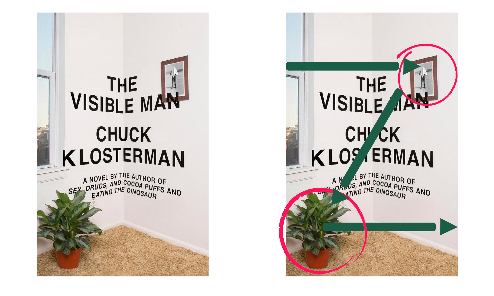
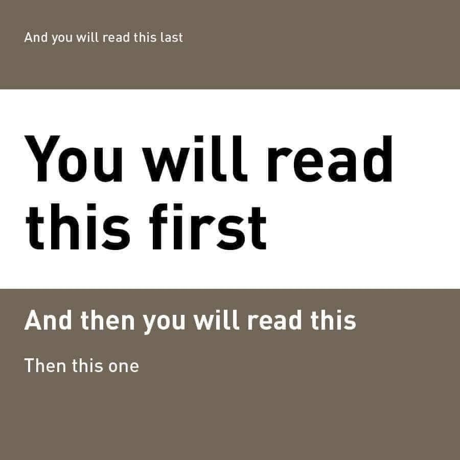
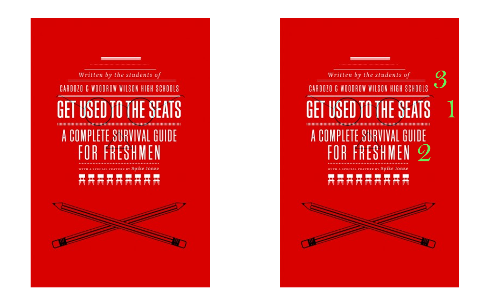
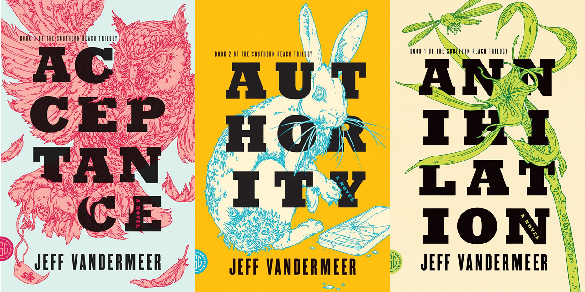
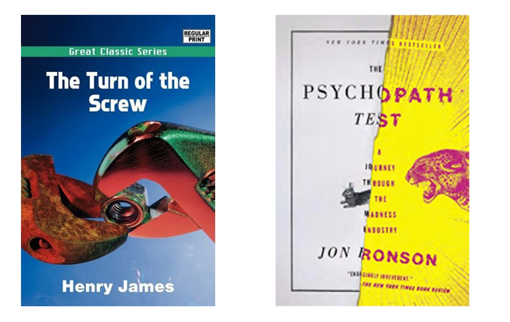

<!--StartFragment-->

> “Covers are the first bit of customer-facing marketing that your reader will ever see. They’re a shortcut—telling the reader in shorthand that they’ll like this book, that it’s in the genre they love to read, and that the person who wrote it is someone they can trust with their valuable (often limited) reading time. That’s a lot of information to pack into one image, and still make it effective."- [Kevin Tumlinson](https://www.draft2digital.com/blog/the-psychology-of-a-good-book-cover/)
>
>

What makes a book cover great is its ability to draw potential readers in, giving them the impression that your book is professional and good quality, as well as signifying all the things it needs to upon first glance (genre, tone, theme, content, etc). Self-published books do not get a green card for having a low budget behind them, and if you want your book to succeed against the so called ‘Big 5 publishers’, who have a large backing of money and experience behind them, you’ll need a book cover which can compete on the same level as their designs.

In this post, I will explain the process of designing your cover, as well as the basic ideas behind design and how you can use them to create a stunning and unique book.

## **Look for sources of inspiration for your cover**

Inspiration can come from places such as other book covers, artists, design studios, museums and archives to name a few. Take a look at my post about finding inspiration for your cover **here.**

As well as wanting your cover to be  eye-catching and good looking, you also want it to connect with your target market. Therefore, one thing you should always do before starting your cover is study other books from your books genre, and see how they’ve designed their covers. You’re bound to notice specific design tropes and motifs appearing on many books within a certain genre. Check out my other posts to see some of the best books and their covers, where I discuss in depth the specific design tropes of the current best selling genres.

A survey taken from book current readers says that **75%** of people would buy a book with a cover similar to one they’ve read before, as they believe it will be a similar reading experience. You want your cover to communicate to the reader that this book is the one they’re looking for, and you can do this by using genre specific design to signal what your book is about upon only a first glance, as well as associating it with other books from a genre.

> “People gravitate toward the familiar. The more familiar something (or someone) is, the better the chances of attraction. When readers are looking for something new to add to their shelves, they want to know that it will be something similar enough to what they’re used to, and already enjoy, that it will fit with the books they already love.”- [Tumlinson](https://www.draft2digital.com/blog/the-psychology-of-a-good-book-cover/)

Of course, this isn't to say that your book needs to be cliche and boring. Whilst using genre specific design tropes, you can still make your cover striking and original with things such as imagery, typography and colours.

*Don't forget about the back cover. Check out this [guide here](*<https://blog.reedsy.com/back-of-book-cover/>*) on how to make a format your whole book cover, including the back!*

## Choosing an image for your cover

If you're new to the book market, or want to branch out to a larger audience than you already have, your cover is crucial. The image you choose for your cover can be the difference between a bland generic looking book, and something which really stands out and catches the eyes of new readers.

Readers can look for books through authors they already like, books friends are reading, current best sellers or a new book in a series. However, when looking for something new, the cover of your book is usually their first experience with your work, and you want to give a good impression. Upon first glance, readers want to know what your book is about, what genre it is, what the action of the book is, the tone of the book etc. If you fail to communicate all this instantly, readers may just pass your book by.

Therefore, the first job of the image on your cover is to resonate with your intended reader, it has to excite them as well as telling them about the book.

## **Make it professional**

This isn't to say you can’t have a silly or quirky cover (if that's what would suit your book), however it does mean that it has to look like it was done professionally, and had a lot of work and effort put into it. Your cover needs to tell that reader that you both have the resources and skills to write a book at a professional level, and that you respect your work and your readers enough to give them the best possible cover you could.

> “Your cover is its own story, and readers are looking at it as a way to help them make a purchasing and reading decision.”- [Tumlinson](https://www.draft2digital.com/blog/the-psychology-of-a-good-book-cover/)

If your cover is unprofessional, it tells people that you don’t care about your book, and they may associate the bad quality cover with the quality of the writing inside your book. If you want to break into a new, bigger market, you must show people exactly how good your book is upon the first look.

## **Make it appropriate for your genre**

Like I’ve already discussed, using genre specific design is a good way to signal to your readers that your book is the one for them. But at the same time, you need to know your genre, so that you know what NOT to do. 

For example, fans of romance would not pay attention to yet another cover depicting a Victorian woman in a fancy dress being held seductively by a tall dark and handsome gentleman. Whilst this may be the perfect book for some, it will not stand out in the market, and it surely won't gain you any respect.

")

If your book cover gets too cliche, that's also going to turn your readers off. **87%** of book readers say that cliche covers would put them off of a book they were interested in, so you should be wary of falling into this trap!

## **Layout and eyeflow**

One thing you might not be aware of if you’re new to design is that you need to have a good composition of things on your page, so that the flow seems natural and engaging. Human eyes notice things that move, they’re designed to track and motion engages our brains and make us concentrate on what it is we’re looking at. Obviously, you can’t actually make your cover move. However, if you can make the reader's eyes flow across the page in a natural and intuitive way, you’ve already got them interested. 

*But how do you make the reader's eyes move across the page?* 

This is where layout becomes important. Good layouts are strategic and balanced, arranging each aspect of the book cover in a way which will make the reader’s eyes look across the whole page, and take in the complete cover. The direction you want the reader to look is up to you, however here are a few examples of tried and tested methods which usually engage the audience's eyes:

* **Z Formation:** this layout is designed to mimic the act of reading, having the eyes move from left to write, from top to bottom. See how the cover below makes your eyes move across the whole page, allowing you to see all the aspects of the design whilst reading the title. The Z formation engages the reader's eyes the same way reading text does, and invoking action helps build engagement with your cover.

* **The big to small method:** A commonly passed around theory within design forums is this idea-

Whilst it’s usually true for most people, this is more of a rule for basic typographical designs. The user mludwig from [GraphicDesignForum.com ](https://www.graphicdesignforum.com/t/you-will-read-this-first/13726)put it like this:

“this tests eye movement for type without the distraction of other imagery”

If you plan on having a simplistic cover which mainly focuses on the typography, try using this layout of text for the order of importance, having your title in the middle, and other text surrounding in the order you want readers to see it.

What order did you read this cover here? This is the way I read it:

* **BIG title:** You can even have the title be the main design focus of your cover, using it as a tool to make the reader's eyes travel the span of the page.

## **Typography is key**

From the big blocky letters on road signs to the delicate flourishes on a Lindor chocolate bar, typography really does affect the way you perceive the daily world, and book covers are no exception to this rule. If you use typography correctly, you can craft a truly memorable cover.

Typography is much more than just selecting a font, if done right it can make your cover stand out to your audience of book buyers. However, if you lazily pick a font and put it on the page randomly, you can create a sloppy looking cover which will put readers off.

With typography comes preformed ideas about what a book will be like, so if yours does not look professional, people will not see your book as professional. 

Take a look at these book covers for example, which would you view as more professional and which would you be more likely to buy?

The typography you use really does tell the tone of the book. Take the image above, the book on the left looks plain and dull, with a boring font featuring no variety across the page. However, the cover on the left uses two different fonts in drastically differnt ways, signifying themes within the book and engaging the reader with its unique design. 

Choose the right typeface and you can make even the plainest book cover stand out!

***I hope this introduction to designing book covers has given you a good overview of the topic. Check out my website for tons more information, lists, resources, guides and tutorials on how to make your own book cover professionally, and have it stand out in the market!***

<!--EndFragment-->