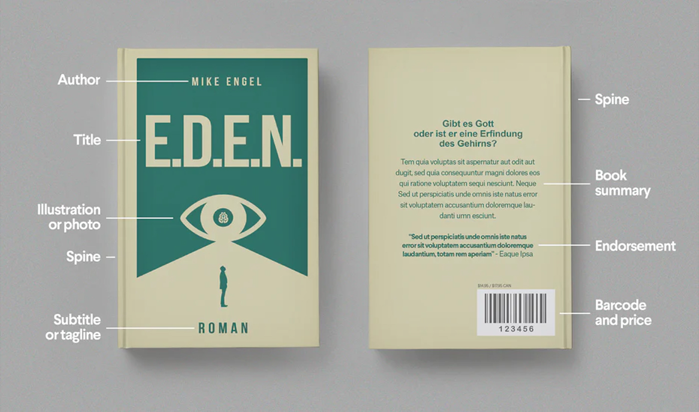

<!--StartFragment-->

Here I will answer common questions people new to design may have, as well as provide many links to free design resources, showing you want tools are available to you as a novice book cover designer. 

## Anatomy of the book cover

The book cover, or dust jacket for hardcover books, includes three parts:

* The front cover- Title, author, illustration/photo, subtitle, tagline
* The spine- Book title, authors name, illustration
* **The back cover- Book summary, endorsement/reviews, illustrations, barcode, price**

For an extensive overview into the typical layout of book covers, [check out this useful article here. ](https://99designs.co.uk/blog/book-design/anatomy-of-a-book-cover/)

## What are the standard dimensions of book covers? 

The dimensions of your book can change depending on what size book you want to create, or what shape. For example, some hardback books are much larger than standard, and some children’s books or non-fiction books come in non-standard shapes, such as square instead of rectangular. However, there are sizes which are standard for the industry. Check out these useful articles which explain all the book dimensions used within book publishing, to see which is right for you.

* **[Book Cover Dimensions- Reedsy](https://blog.reedsy.com/book-cover-dimensions/)**
* **[What Size Should My Book Be?](https://bespokebookcovers.com/book-cover-layout/what-size-should-my-book-be/)**
* **[How To Choose the Right Book Cover Size](https://www.masterclass.com/articles/how-to-choose-the-right-book-cover-size)**
* **[Paperback Book Sizes](https://digital.imprint.co.uk/paperback-book-size/)**

## How much does it cost to hire a book cover designer?

The publishing agency [Reedsy](https://reedsy.com/) claims that:

> “Budget naturally plays a role in an indie author’s publishing decisions. On our marketplace, [p](https://reedsy.com/design/book-designer)rofessional designers charge, on average, $650 to design a book cover. However, roughly 20% of the designers we polled will charge under $400 — and if you manage to find a super-talented newbie who can do a simple design, it might be even less.”- [Reedsy](https://blog.reedsy.com/book-cover-design-software/)

The design website [Book Beaver](https://www.bookbeaver.co.uk/) also says that:

> “Generally speaking a cover based on stock images and photo manipulation will cost between £270 - £450. Book covers based on illustrations can cost anything from £500 - £1300 depending on the complexity of the artwork.”- [Book Beaver](https://www.bookbeaver.co.uk/blog/book-cover-design-costs)

However, understandably not everyone has this high of a budget to go towards their cover. Don’t worry, this is what my website is here for!

## Where can I learn more about design/how to use design software?

Here is a list of free design learning platforms, to help you get a grasp of where to start if you’re a beginning at design:

* [Lynda](https://www.linkedin.com/learning/topics/graphic-design)
* [Udemy](https://www.udemy.com/)
* [YouTube](https://www.youtube.com/)
* [Coursera](https://www.coursera.org/)
* [Domestika](https://www.domestika.org/)
* [SkillShare](https://www.skillshare.com/)
* [Career Foundry](https://careerfoundry.com/)
* [Mockplus Tutorials](https://help.mockplus.com/)

## Where can I learn more about using colours?

These are a few of the best free websites which can help you learn about colour theories and how to choose colour palettes.

* [Coolors.co](https://coolors.co/)
* [Adobe Color](https://color.adobe.com/)
* [Colorion.co](https://www.colorion.co/)
* [Flat UI Colors](https://flatuicolors.com/)
* [Paletton](https://paletton.com/)

## Where can I learn more about fonts and typography?

Typography can be a hard design aspect to handle for a beginner, and can often be the reason for book covers looking unprofessional. Luckily, there are many free resources online which can help you learn typography design theory, as well as show you what fonts go together:

* [DaFont](https://www.dafont.com/)
* [My Fonts](https://www.myfonts.com/)
* [Font Squirrel](https://www.fontsquirrel.com/)
* [Google Fonts](https://fonts.google.com/)
* [Type-Scale](https://type-scale.com/)

## Where can I find free illustrations to use for my cover?

Having an illustrated cover is a good way to make your book look fun, trendy, professional and unique, however hiring a professional illustrator can be out of the budget for many self-publishing authors. Here are a few free resources where you can find free illustrations for your cover:

* [Draw Kit](https://drawkit.io/)
* [UnDraw](https://undraw.co/)
* [Illustrations.io](https://illustation.io/)
* [Humaaans](https://www.humaaans.com/)
* [Glaze Stock](https://www.glazestock.com/)
* [Isometric](https://isometric.online/)
* [Prisma](https://prisma-ai.com/)
* [Absurd Design](https://absurd.design/)
* [Freepik](https://www.freepik.com/)
* [Creative Market ](https://creativemarket.com/)
* [Ouch!](https://icons8.com/illustrations)

## Where can I find icons to use for my book?

A few of the best free icon resources include:

* [Icons8](https://icons8.com/icons)
* [Ikonate](https://ikonate.com/)
* [IconMonstr](https://iconmonstr.com/)
* [Feather Icons](https://feathericons.com/)
* [Font Awesome](https://fontawesome.com/)
* [The Noun Project](https://thenounproject.com/)
* [Material Design Icons](https://materialdesignicons.com/)

<!--EndFragment-->