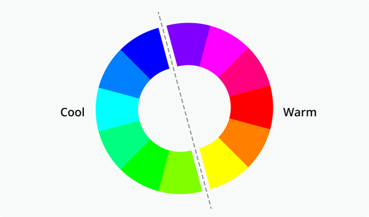
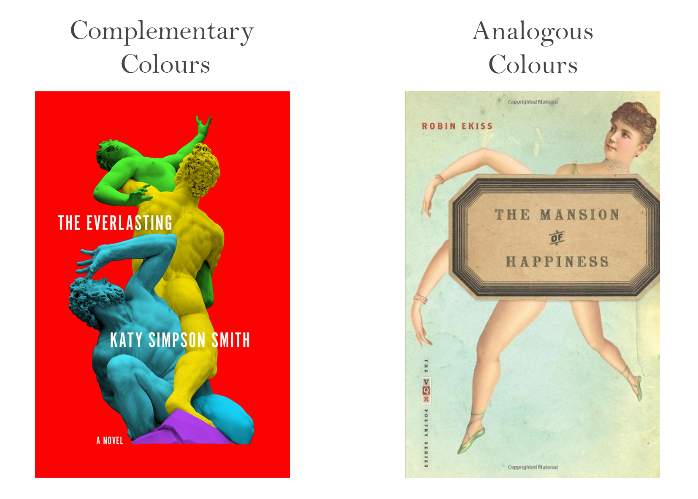
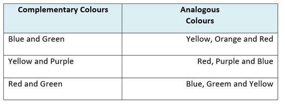
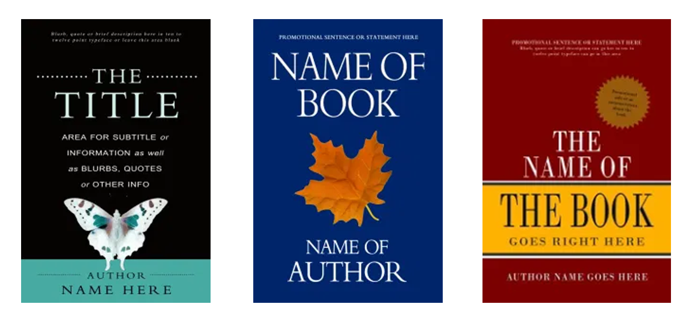
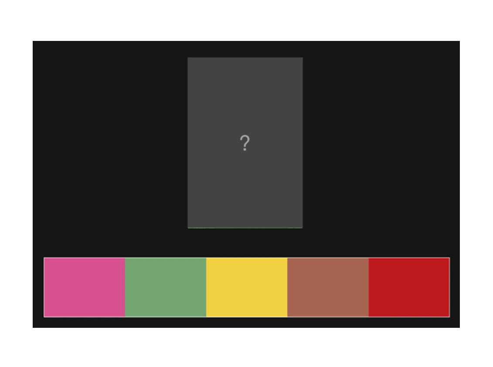
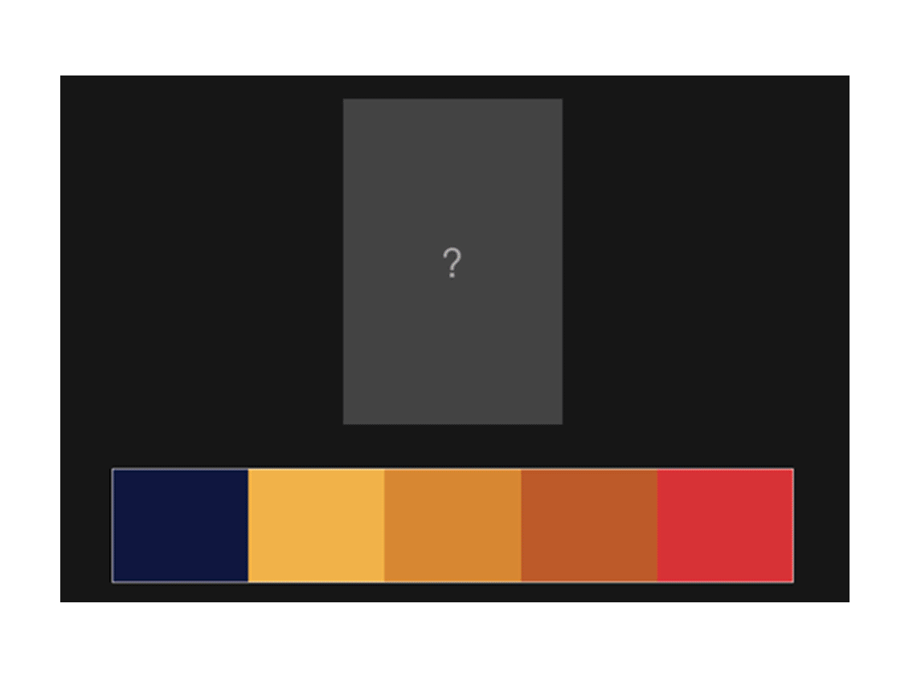
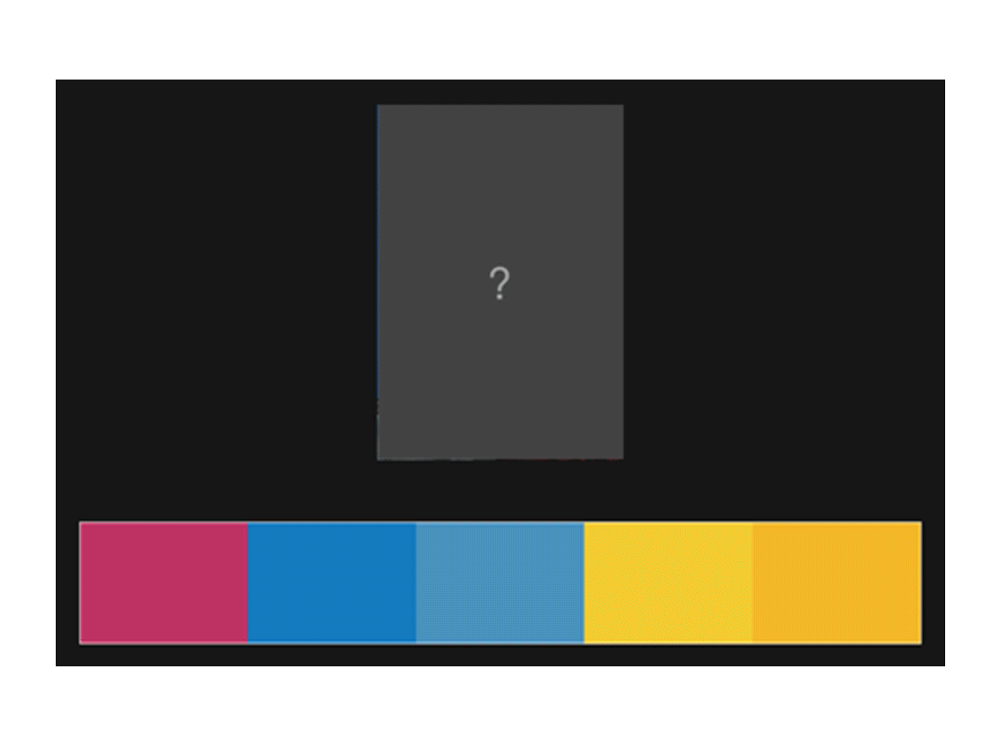
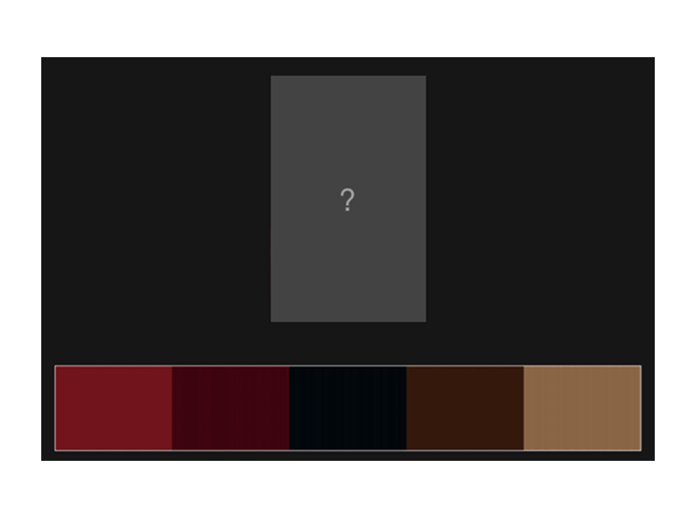

<!--StartFragment-->

The colours you use for your cover play a big part in creating the tone and feel of your book. The dominant colours you choose will influence how readers perceive your book, setting the mood and creating contrast which is necessary to draw the eyes of potential readers. Black and white is always a classic and timeless way to make something look professional, but when using colours you’ll want to try and stick to these two colour palette choices:

* **Complementary Colours:** these are colours found opposite each other on a colour wheel. Used together they create energy and power, making your book eye-catching and loud.
* **Analogous Colours:** these are colours found next to each other on the colour wheel. They have a tranquil and harmonious look, giving your book a calm and pretty look.

If you’re using an image for your cover, the most dominant colours on your image will decide your colour palette. Take a look at these examples made by Stacie Vander Pol at [Cover Designs Studios](https://www.coverdesignstudio.com/best-colors-book-covers/).

Vander Pol claims this about these book covers:

> “The first of the three book covers below adds a color band at the bottom taken from color in the butterfly. Alternately, the second book cover image uses a background color complementary to that of the graphic (orange and blue). If you aren’t using graphics, you can include color blocks to add color and create contrast to your book covers, as shown in the third example, with analogous colors.”- [Pol](https://www.coverdesignstudio.com/best-colors-book-covers/)

## What colours mean

Your colour selection should start with the mood you want to create with your cover. White and off-white colours can make a professional looking clean cover, whilst dark blacks and reds can make a dark horror cover. This is because we have a lot of associations with colours and specific colour palettes, and what we expect to see them on. 

Take a look at these examples from **Adam Blades**, a lecturer at Oxford Brookes University. Try and guess what type of movie each colour palette is for:

 

You can clearly see how colour creates expectations, and you want your cover to clearly express to the reader exactly what your book is about, meaning picking the right colours is essential.

 

**Check out this chart from [Cover Design Studio](https://www.coverdesignstudio.com/best-colors-book-covers/), detailing each colour and its associated meanings.**

* **Red-** Energy, enthusiasm, emotion, power
* **Dark Red-** Passion, depth, dominance, prestige 
* **Orange-** Positive, dynamic, optimistic, confident
* **Pale Yellow-** Friendly, approachable, warm
* **Bold Yellow-** Ambition, motivation, creativity, cutting edge
* **Green-** Nature, vitality, environment, health
* **Blue-** Dependability, trust, thoughtfulness, calm
* **Dark Blue-** Deep sincerity, intuition, truth
* **Light Purple-** prosperity, spirituality, creativity, harmony
* **Dark Purple-** Depth, wealth, mystery, fantasy
* **Grey-** Sophistication, knowledge, prestige, wisdom
* **Pink-** Youth, playfulness, emotion, innocence
* **White-** Clean, straightforward, self-sufficient, simple
* **Black-** Authority, power, control, mystery, suspense
* **Brown-** Natural, of the earth, comfortable, organic

## Choosing your covers colour palette

Whilst you do want to pick the right colours to convey the correct meaning, you also want them to work well together. Even the most experienced designer can struggle to choose a good colour palette, however don’t worry! There’s lots of different resources online to help you pick the right palette. Here’s a few of the best websites for helping you pick your colours.

 

* **[coolors.co](https://coolors.co/)**

This website will help you choose colours based on many different professional premade palettes. You can also upload your own photos and have a colour palette generated from it, which is extremely useful if you’ve already picked the picture/ illustration you want for your cover.

 

* **[Adobe Colour](https://color.adobe.com/create/color-wheel)**

This professional tool is extremely useful for making a palette, giving you the option to pick individual colours and showing which colours go with it.

 

* **[Canva](https://www.canva.com/)**

If you use Canva to make your cover, they have hundreds of free to use professional made colour palettes which you can apply directly to your cover using their advanced and easy to use software.

 

A few more free resources for learning about colours include these: 

* [Colorion.co](https://www.colorion.co/)
* [Flat UI Colors](https://flatuicolors.com/)
* [Paletton](https://paletton.com/) 

 

 

 

*Overall, trust your instincts! When designing a book cover you can usually tell if certain colours go together or not, and if something feels off to you try mixing up the colours with a new palette. If you keep experimenting with colours eventually you’ll find something which is perfect for your cover.*

<!--EndFragment-->