<!--StartFragment-->

If you’re determined to take the sourcing of your book cover image into your own hands, or simply lack the funds to hire a professional designer, here are some options for the best royalty-free stock photo websites available. I’m going to start with the sites that offer free stock photos, before showing the options for websites with the option to purchase royalty-free photo licenses.

## Free stock photo sites:

##### 1. Unsplash

[Unsplash](https://unsplash.com/) is a large database of free, high- resolution photos. It has some truly excellent and professional royalty-free photos available, and even if it does not have the image you're looking for, the large curation of pictures may help you create a mood board or spark some inspiration for your cover.

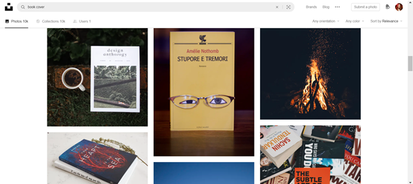

##### 2. Pixabay

[Pixabay](https://pixabay.com/) is a popular site for professional designers due to the vast variety of images available, including photos, vectors and illustrations. Their content is produced and released under their own license, meaning you can use their images without permission. While you aren’t required to credit the artist under the terms of service of the website, it’s still good practice to do so.

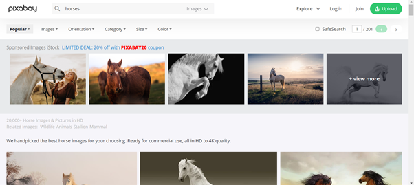

##### 3. Pexels

[Pexels](https://www.pexels.com/) is a very user-friendly site if you want to find a good image for your cover, as new photos are added every day. The site is both easy to use and slick, and the photos are very well tagged, meaning it’s easier for you to find exactly what you’re looking for- a great tool if you are searching for a genre-specific photo.

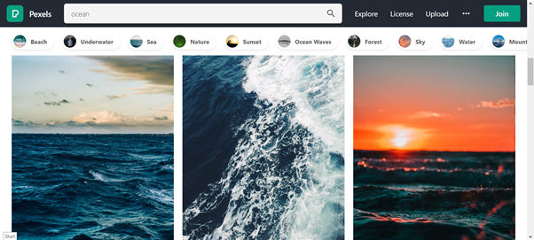

##### 4. Canva

Whilst [Canva](https://www.canva.com/) is mainly used as a design tool website, they have an extensive library of stock images and illustrations which are free to use even with their free membership plan.

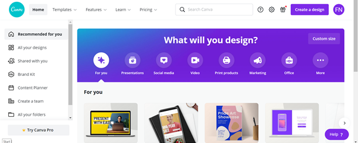

##### 5. StockVaults

While [Stockvault's](https://www.stockvault.net/) database is one of the smallest on this list, you can tell the people behind the website put real effort into organising their photography, wallpapers, illustrations and graphics.

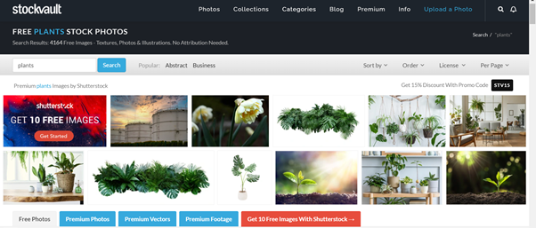

##### 6. Reshot

[Reshot](https://www.reshot.com/) is another free to use stock site, who pride themselves on their more unique images and illustrations. They aren’t as useful for looking up genre-specific photos (for example, if you search the term ‘romance’ you won’t find much), but if you already have a clear idea of what you’re looking for, you may be able to find a professional looking photo here. 

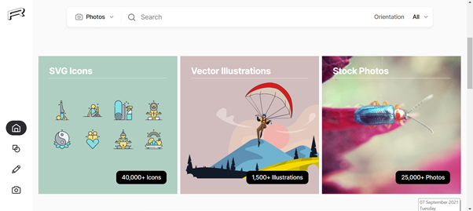

##### 7. New Old Stock

This site is a little more unique: [New Old Stock](https://nos.twnsnd.co/) is a database of vintage and archived photos that belong to the public domain, and therefore are not bound by any copyright restrictions. If your book is a historical novel, this could be a great resource to find an original and unique photo.

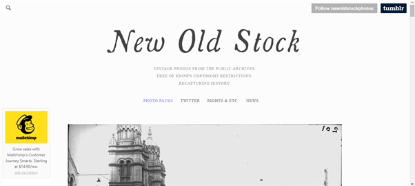

##### 8. StockSnap

Another free site with a variety of choices, [StockSnap](https://stocksnap.io/) has a good range of background and landscape images.

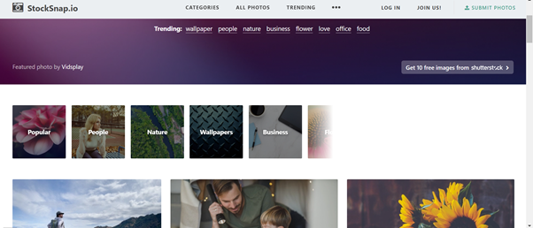

##### 9. FoodiesFeed

This one is pretty self explanatory, [FoodiesFeed](<https://www.foodiesfeed.com/)>) is a free to use database specialising in photos of food. If food happens to be a big part of what you're writing about, or you're looking for a good quality photo for your cookbook, you’ll probably find a delicious looking photo to match it here.

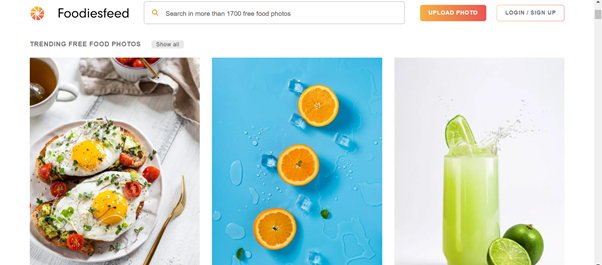

## Paid for stock photo sites:

##### 10. iStockphoto

Whilst [this option ](https://www.istockphoto.com/)can be on the pricey side, this offshoot of Getty does boast a database of millions of photos, clip art, videos and illustrations for royalty-free use. A lot of care has gone into curating the [iStockphoto](https://www.istockphoto.com/) library, and it includes some good genre-specific pictures.

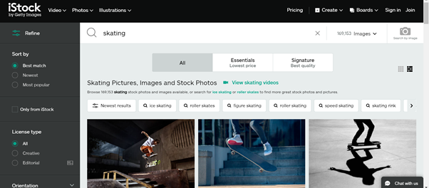

11. Shutterstock

[Shutterstock](https://www.shutterstock.com/) is probably the first to come to mind when you think about stock photography websites. The prices can end up a little high if you’re not buying pictures in bulk, however their massive library of over 200 million quality photos is nothing to scoff at.

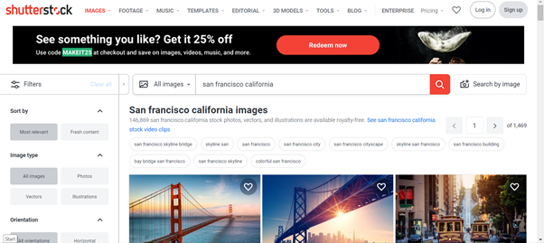

##### 12. 123rf

The [123rf](https://www.123rf.com/) library is host to over 90 million images, as well as illustrations, book fonts, vector graphs and icons.

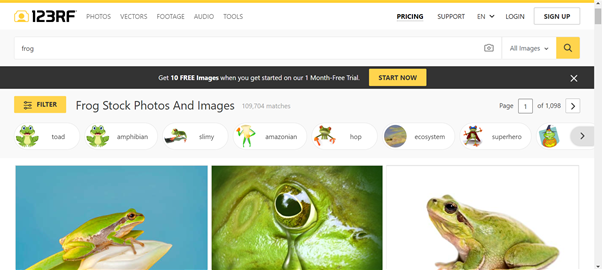

##### 13. Arcangel

[Archangel](https://arcangel.com/) actually specialises in book cover photography, even going so far as to organise their photo libraries by book cover themes and genres. Whether your book is about cooking, post-apocalyptic adventures or a witch coven, Archangel should have an image perfect for you.

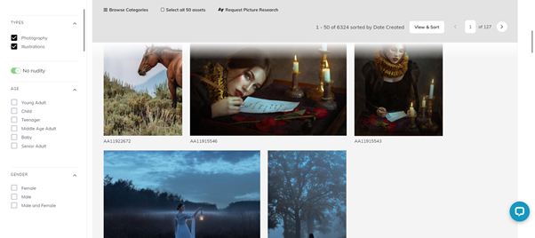

##### 14. DepositPhotos

Besides the free options, [DepositPhotos](https://depositphotos.com/) is one of the more affordable options for quality stock websites. They boast a unique collection of illustrations, which could be a great alternative to photography on your cover.

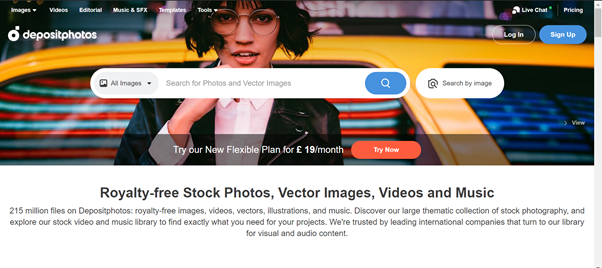

##### 15. The Stock Alchemist's

[The Stock Alchemist’s](https://www.thestockalchemist.com/) unique draw is that they create character photos for designers to use on book covers. They carry photos for many different genres, such as science fiction and dystopia. They also pride themselves on the diversity of their models; they have a whole section dedicated to gender non-conforming models.

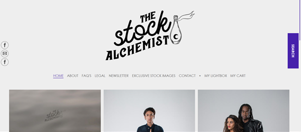

##### 16. Period Images

[Period Images](https://www.periodimages.com/) is a boutique style stock site which specialises in character shoots which can be used for book covers. As the name may suggest, their pictures are mainly historical, however they also do a lot of couple shots, so this could be the perfect site for you if you're looking for an image for your historical romance book.

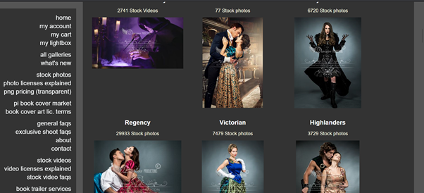

##### 17. Alamy

[Alamy](https://www.alamy.com/) is probably the most extensive stock photo database, with over 100,000 new photos added daily. There is a lot to sort through, however this also means there is great flexibility and choice when looking for a book cover image.

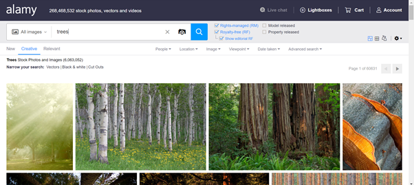

##### 18. PikWizard

[PikWizard](https://pikwizard.com/) does have a free to use collection of images, however their premium collection of images  which is more appropriate for book covers is reasonably priced.

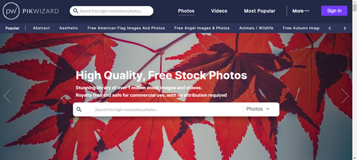

##### 19. Getty Images

Another giant in the stock photo industry is [Getty Images](https://www.gettyimages.co.uk/). Their website has not only won awards, but boasts hundreds of millions of consistently good quality asserts. Their content can end up being pricey, but it’s worth giving their collections a browse just to see the sheer size of it.

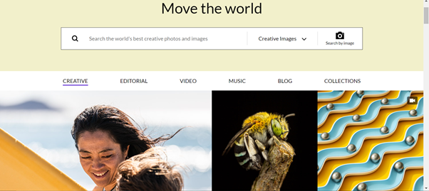

##### 20. Rawpixel

Just like PikWizard, [Rawpixel](https://www.rawpixel.com/) offers some free images, but their better quality assets cost money.

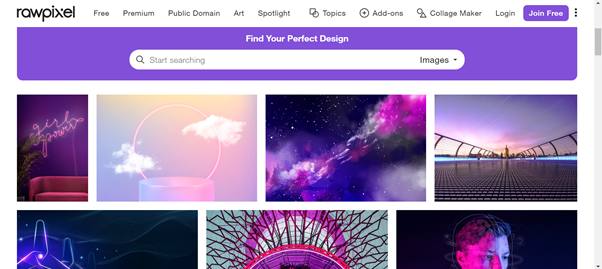

*Hopefully, these 20 stock photo sites provide you with a good place to start your search! Remember to use stock photos properly by finding suitable images, which are legal to use and haven’t been put on someone else's front cover already. And good luck designing!*

<!--EndFragment-->