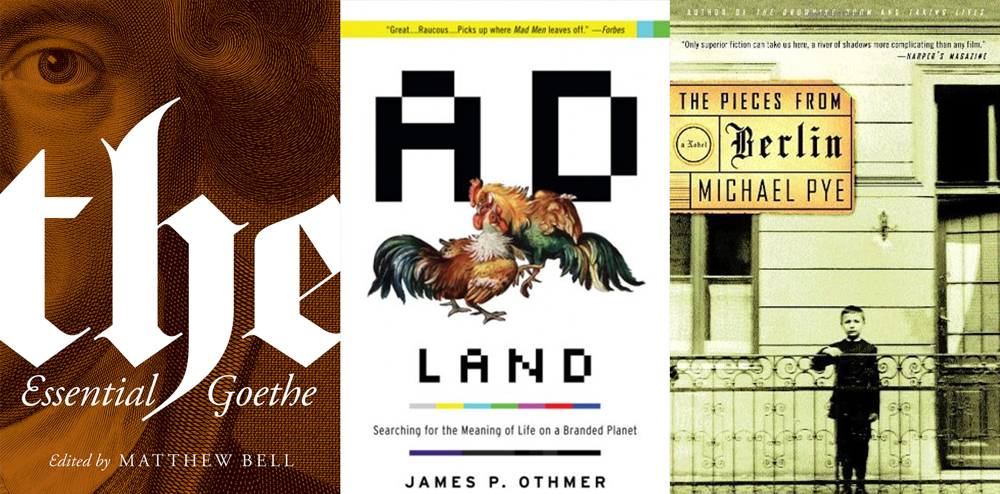
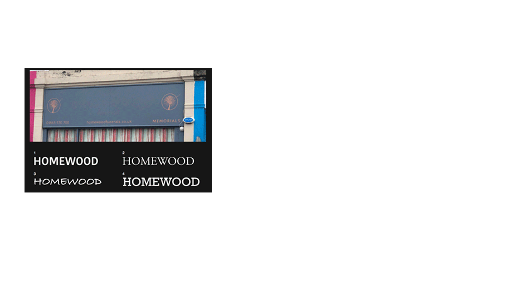
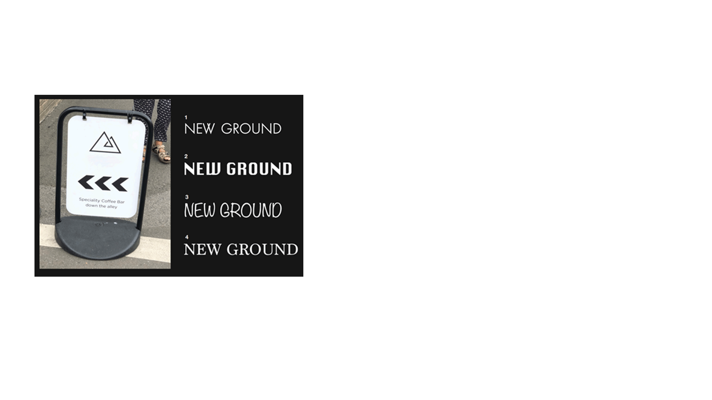
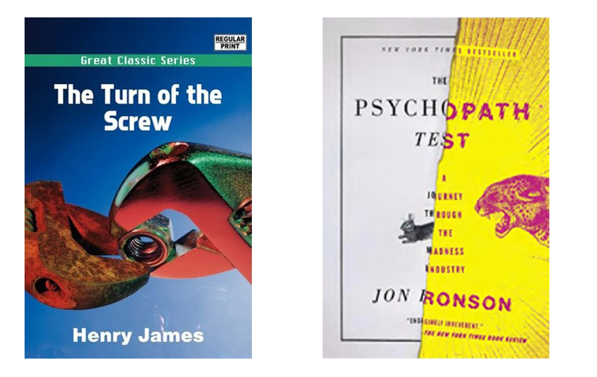
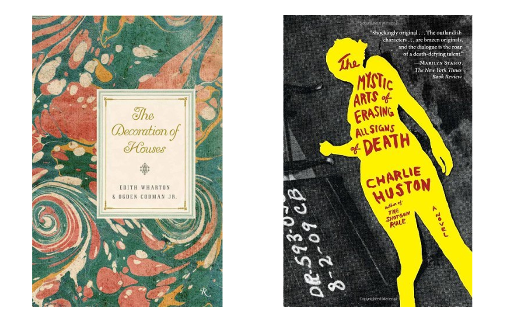
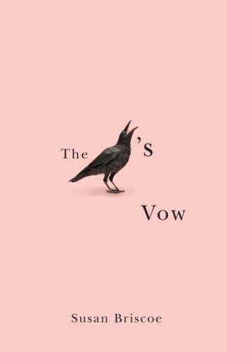

<!--StartFragment-->

If you’re new to design, you’re probably wondering what typography is and how to properly use it for your book cover. For beginner designers, this part of the design process is often forgotten about or thought of last, however I’m going to show you how important it is and how it even affects everyday life.

From the big blocky letters on road signs to the delicate flourishes on a Lindor chocolate bar, typography really does affect the way you perceive the daily world, and book covers are no exception to this rule. If you use typography to the fullest extent, you can craft a truly memorable cover.

# What is typography?

According to The Concise Oxford Dictionary of Art Terms typography is:

> "The art or process of setting and arranging printed text involving the choice of the typeface—the font, size, and spacing to be used—as well as the particular alphabet—Roman, italic, boldface, etc"

To break it down into more simple terms, typography is:

“the art of arranging text in a legible and visually pleasing fashion.”- [Reedsy](https://blog.reedsy.com/freelancer/what-is-typography/) 

The essentials of typography include fonts and typefaces, how you arrange them, using tools such as kerning (the space in between each individual letter) and leading (the space in between each adjacent line).

# Why is typography important?

Typography is much more than just selecting a font, if done right it can make your cover stand out to your audience of book buyers. However, if you lazily pick a font and put it on the page randomly, you can create a sloppy looking cover which will put readers off.

With typography comes preformed ideas about what a book will be like, so if yours does not look professional, people will not see your book as professional. 

Take a look at these examples from Adam Blades(a lecturer at Oxford Brookes University) , which show the unconcious associations that come with typographical design, and how it can change our perceptions of what something should be just from using a certain font. 

Try and guess which font you think goes with each sign:

As you can see, design and typography is inseparable from preformed associations we don't even realise we have, and you want readers to associate the right things with your cover.

# What can typography do for your cover?

#####  

### Well done and clear typography lets readers understand your books story

*Which is easier to read? Which draws your eyes across the page and tells you what the book is about?*

The least glamorous part of typography is its function, and how it allows people to easily read your text. If your type is clear and understandable, it allows readers to quickly take in your book and your title, grabbing their attention and telling them what your book is about. However, if your typography is bad, it diverts the audience's eyes away from the writing, and forces them to focus on the arrangement of the page.

Using the complete wrong typeface and font can even make a cover illegible, or wrong for the context of the book, e.g. using a romantic script font on an action thriller book, making the audience confused about what your book is, and forcing them to try and decipher your cover instead of selling your book to them.

### Good typography gets the reader's attention 

*Which cover grabs your attention more? Which do you want to read?*

The best typography can make your book stand out and grab the attention of any passing reader. 

### Unique typography can help you create a brand for your books, or as an author

*These covers are obviously all from books in the same series, and the typography helps signal that.*

A cover with well done typography does more than just look good on the shelf, it can also leave a big impression in the reader's mind. If your typeface perfectly represents your book, it can help give your book a brand which helps readers recognise your books just from the front cover. It can also help readers know which of your books are in the same series.

### Professional typography helps your book seem like a high quality product

These books would both look stunning in any home, as they look professional and good quality. 

For your readers, your book's cover design, including the typography, is a sign of how much time and effort you’ve put into the book itself. If the cover looks unprofessional and bad quality then people will associate that with the contents of the book- which is obviously not something you want readers to have from a first impression of your book!

"To potential readers, a book’s design — typography included — is a proxy for the time and care the author put into making a quality."- [Reedsy ](https://blog.reedsy.com/freelancer/what-is-typography/)

## Tips to getting it right:

Even after all this information, you may still be struggling to get your typography exactly right. Check out these articles and resources for a comprehensive guide to choosing and pairing fonts: 

* [Branding and Fonts](https://www.canva.com/learn/canva-for-work-brand-fonts/) 
* [Ultimate Guide to Font Pairing](https://www.canva.com/learn/the-ultimate-guide-to-font-pairing/)
* [DaFont](https://www.dafont.com/)
* [My Fonts](https://www.myfonts.com/)
* [Font Squirrel](vhttps://www.fontsquirrel.com/)
* [Google Fonts](https://fonts.google.com/)
* [Type-Scale](https://type-scale.com/)

##### *Try keeping these pointers in mind when designing the text on your cover:*

* Look at how books of the same genre use typography. What fonts/typeface do they use? Do they have the title forefronted or more in the background? Is the text heavy or light looking?
* Have some variety. Try not to use the same font/typeface for all the text on the cover, but also don’t go wild and have 20 different fonts. (There’s always exceptions to the rule! If your design deliberately breaks conventions this can also end up looking unique and professional, if done right.)
* Avoid fonts with other associations, e.g. don’t have Papyrus or Comic Sans on your cover, or you may end up with an unintentional disaster!
*  It’s OK to keep it simple. Don’t fall into the trap of adding more and more to your cover in the hopes that it’ll turn out looking good. Whilst some books have busy covers which look very good, they are always crafted very deliberately by a professional. If you attempt to try this kind of design as a novice, it may end up just looking jumbled and too crowded. The famous designer Coco Chanel once said “before you leave the house, look in the mirror and take at least one thing off.” Sometimes less IS more, so try out a simple design and typography if you’re struggling to make your cover look good. 

*Overall, remember that typography can either make or break your book cover, and it’s definitely not something to be forgotten about and thought about last when designing your cover!*

<!--EndFragment-->