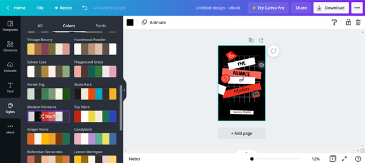
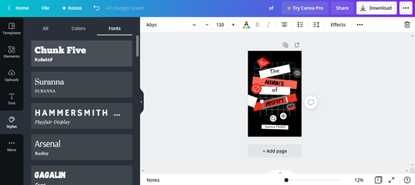
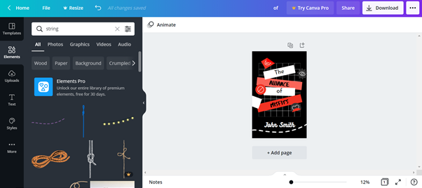
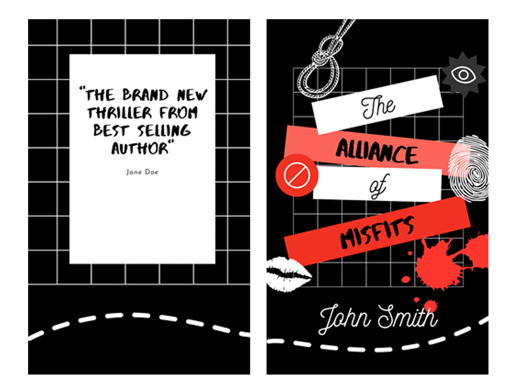
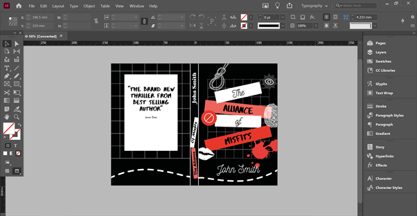

<!--StartFragment-->

Canva is a free to use image editing service, designed to help you produce professional infographics, posters, advertisements, and most importantly for you, book covers.

The technology behind the software allows for even the least experienced designer to create something that looks professional, and offers inspiration for those who have no clue where to start when it comes to the design of their book cover. 

Even if you are dead set on making your book cover from scratch, Canva can be a useful tool for brainstorming the themes and layout of your cover.

If you are inexperienced in design, it is important to make use of your resources. If you know any graphic designers, through a local writing group or even through a contact, do try and at least get their opinions on your cover design before publication. However, sometimes we are left with no choice but to take things into our own hands, and this guide will help you get started.

## Canva: What is it and how does it work?

[Canva](https://www.canva.com/learn/design/) is an app-based tool crafted for designing and editing images. It takes all the essential aspects of apps like photoshop and indesign that makes them good, and crafts them into a new, easy and free to use photo editing program.

Whilst Canva is free to use, with a wide range of features in the free version, it does have a paid for upgrade with additional features that you may find benefit your cover. Whilst it’s understandable if you want to publish your book as cheaply as possible, it does pay off in the long run to invest in your book looking as professional as possible, and having a well done and interesting cover is a worthwhile investment in the success of your book.

The subscription fee for the upgraded version of Canva is reasonably priced, and if you decide to use this software to make your cover you can be smart about it and make use of the 30 day free trial period (that is if you plan to use Canva as a one off, and not for another book in the future).

Canva Pro has some interesting features you might find useful, however, you can more than make do with the free version for your book cover.

## **Why use Canva for your cover?**

You have access to many types of pre-designed book covers and a dedicated book cover designer that gives you a lot of choice of book cover templates.

Below the first few categories visible, there is a wide variety of covers that are genre specific. Even if you don’t want to use Canva to make the final version of your book cover, it is a very useful tool to get inspiration for your cover which is genre specific, making sure your cover fits the target demographic of your audience. 

Canva Free also gives you access to premium images which you can buy from as little as £1, so it is still affordable no matter which plan you choose to use. 

If you are new to design, Canva really is the most affordable and easy to use alternative to software such as photoshop and Indesign, and even helps inspire those who have no idea where to start.

## Using Canvas Designer

To show what you can do with Canvas book designer, I’ve tried creating a book cover that takes inspiration from Holly Jackson’s ‘A Good Girl’s Guide to Murder’, and have put my own spin on it.

I started out by picking a pre-made template from the young adult themed section of their book covers.

I then used the colour selector to change the colour palette to a more horror themed cover, with reds, blacks and whites. Canva Free also has pre-made colour palettes made by professional designers, so you don’t have to worry about picking colours that go together.

After this, I used the font tool to edit the title and author's name. There are font pack themes, but you can click on the individual words and change each font respectively.

I then went to Elements and searched for clip art of things I thought would go with the YA horror cover, such as ropes, finger prints and blood stains.

Here's what I produced with the template I started with:

I’ve designed my cover to fit an A5 book- however, you may notice something is missing. The front and back cover are not joined, and the spine is missing. 

Whilst this limitation is fine if you’re just looking to make a cover for an ebook (which typically does not include a spine or back cover), or are simply using Canva as a tool for inspiration and planning, if you do want to finish the whole cover of your book using the designs you’ve created on Canva, you will have to use another software to finish off.

There are many options available for free book cover design software, such as Gimp, Blurb Bookwright and Visme, all of which you can use to upload both your front and back cover, as well as add a spine. 

Here is my finished book cover I've completed in Adobe InDesign: 

## Canva: The Final Word

If you’re new to design, or have little experience with book cover designs, but still want to create your own front cover, Canva is a good solution which is easy to use and free. Great book cover design is very complex and takes a while to get a hang of, even for talented illustrators and designers, but for a simple cover that needs to look professional and eye catching, Canva has a wide variety of tools and a selection of stock images and graphics which will help you create something with a polished finish. 

Just understand that a full cover is not as simple to do with Canva, but is still achievable. It is, however, the perfect tool if you’re looking to make a front cover for an ebook, or are just looking for design inspiration.

<!--EndFragment-->