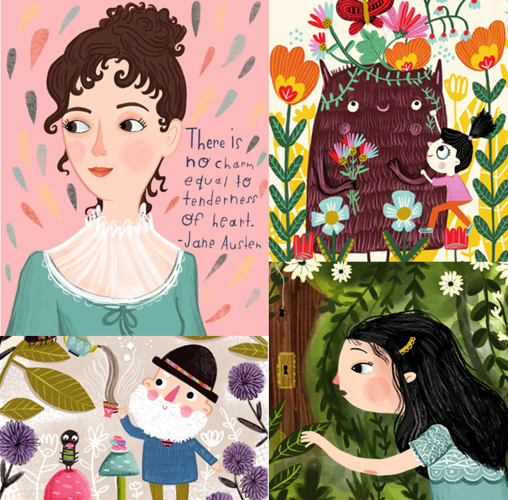

<!--StartFragment-->

Children’s fiction is one of the most lucrative genres of books, with Nielsen Bookscanner (an advanced data collection database) reporting that in the UK there were a total of 13.8 million volumes of children’s books sold in 2020, making a profit of £86.5 million.

> **Volume sales:  13,843,227**
>
> **Value Total: £86,495,708.94**

However, with this massive marketplace comes a huge oversaturation of books- if you want your book to stand out in the sea of children’s fiction, you’ll need to have a colorful, fun and engaging cover that will draw children to your book. 

Children’s books are a space for imagination and creativity, and many times what makes these books magical are the illustrators behind them.

Whether you want to hire a children’s illustrator to create a fantastical cover for your children’s book, or you want them to decorate each page with engaging artwork, this list will help you decide who you want to hire. 

 

We can all remember children’s book illustrators that stood out to us as kids. For some it’s the simplistic colourful style of Jacqueline Wilson, and for others it's the calming and gentle watercolours of Beatrix Potter’s Peter Rabbit. The best illustrators not only helped us imagine our favourite worlds, but also made us fall in love with the memorable characters and beautiful stories being told.

Whilst many children’s books are both written and illustrated by the author, it is also common for the author to hire an illustrator to help them imagine the world they’re creating. If this is where you’re currently at, with an idea for a children’s book but no way to illustrate your cover or the pages, I want to help you with the task of bringing your story to life. So which illustrator should you hire that will create the perfect combination of your writing and their images?

In this post, I’ll show you 15 of the best children’s book illustrators you can find in the industry today, and show you exactly how you can hire them. If you’re ready to plunge into a magical world of colour and imagination let's begin!

 

## 1. Katie Risor

 

*Photos from @creekkidart on Instagram*

Katie Risor’s work is both fantastical and enchanting, from the mountains come to life to the cheeky little trolls in her art . Her artwork would fit perfectly into a collection of fantasy or fairytale style books. She keeps the world feeling light and colourful with her fantastic use of lighting and perspective.

Risor is both talented at drawing original imaginary creatures, and expressing their emotions- all the while making it cute and engaging!

Looking to create an enchanting, immersive and truly fun illustrated children’s book? [Check out Katie Risor's portfolio here.](https://reedsy.com/katie-risor)

## 2. Laura Watson

*Photos from <https://childrensillustrators.com/LauraWatson/portfolio>*

Laura Watson has a talent for depicting the world the way a child sees it, with bright colours, fantastical creatures and genuinely happy looking characters. Her style is a combination of sweet and happy characters, in fun and engaging settings. Her illustrations expertly express the intended mood of each image, whether it’s the boundless energy of children playing, or the tranquility of a peaceful scene.

Not only does she do these characterful scenes, she also creates beautiful typography posters, which may be perfect for your book, or even your cover!

Looking for sweet, heartwarming and fun illustrations for your children’s book? Look no further! [Give Laura Watson’s portfolio a look here.](https://childrensillustrators.com/LauraWatson/portfolio)

## 3. Jessica Gibson

*Photos from <https://www.jessicamgibson.com/>*

 

Jessica Gibson’s collection boasts a beautiful menagerie of animals and nature scenery, as well as playful illustrations of children and woodland creatures. 

According to Jessica Gibson’s portfolio, her artwork is massively inspired by nature: 

> “I been drawing whimsical , expressive characters and concept art since the moment I first picked up a pencil. A love of animals, nature, and picture books have always inspired me and led to a career in illustration.”- [Gibson](https://www.jessicamgibson.com/)

If you want to hire this illustrator to create stunning illustrations for your children’s book, [have a look at her portfolio here](https://www.jessicamgibson.com/).

## 4. Mai Kemble

*Photos from <https://maiskemble.com/>*

There is a magical touch to Mai Kemble’s work, with charmingly dressed animals taking a ride in a carrot-car, to children taking a midnight cruise on the back of a pair of swans. Whether your book is about children going on a nighttime adventure, to a high fantasy story with princesses and chipmunk companions, Mai Kemble’s art will help elevate your work to the next level. [Check out her portfolio here.](https://maiskemble.com/)

## 5. Andy Catling

*Photos from https://www.catling-art.com/*

Andy Catling’s work is a fantastic display of emotive, unique and highly stylised characters. He uses exaggerated shapes and intricate linework to create a world that feels magical and eccentric. Just a quick browse of his portfolio will leave you entertained and eager to join the fun he creates in his artwork. [Check out his portfolio here.](https://www.catling-art.com/gallery)

## 6. Evgenia Malina

*Photos from <https://www.evgeniamalina.com/sketchbook>*

If you also grew up reading Roald Dahl’s books, you’ll be certain to remember Quentin Blake’s stunning illustrations featured in his stories. Evgenia Malina’s work will transport you right back to this style, and if you were a fan of Blake’s work, you’ll fall in love with Malinas; you can see reminiscence of his style in her own original works. The scratchy lineworks create light and elegant artwork, and the wonderful colours help bring her unique characters to life.

If you want to hire this quirky illustrator for your children’s book, [check out her work here.](https://www.evgeniamalina.com/sketchbook)

## 7. Francesca Filomena

##  

*Photos from @francesca_filomena_illustrator on instagram*

Francesca Filomena’s inimitable style will transport you to a wondrous world of imagination and dreams filled with surprises. Her use of colours makes her work both atmospheric and intriguing, provoking you to think about the world she is creating. Filomena’s collection of work will leave you convinced that art is the best medium to allow children to explore the imaginary world you have created in your book.

If you want to feature Francesca Filomena’s dreamy illustrations in your story,[ check out her portfolio here.](https://www.instagram.com/francesca_filomena_illustrator/?hl=en)

## 8. Isabelle Arné

*Photos from <https://isabellearne.com/isabelle-arne-portfolio/>*

Isabelle Arné's work transforms the normal into the extraordinary. The vibrant colours and fluid lines make you feel like the picture is moving alone with your imagination, transporting you into her magical world for as long as you get lost within her artwork.

Arné also boasts a large arsenal of mediums; she has a massive range of work, from watercolours to digital artwork. I challenge you to take a look through her gallery and leave not feeling inspired and ready for more.

If you want to use Arné’s warm and joyous illustrations in your work, [check out her portfolio here.](https://isabellearne.com/isabelle-arne-portfolio/)

## 9. Taylor Barron

*Photos from <https://www.taylorbarron.com/childrens-books>*

Taylor Barron’s art is a delight to look at. Her bright colours and dynamic shapes make the art come to life, and work perfectly in harmony with the mood of each image. She has a background in motion graphics and animation, which explains the fluid way her art seems to move across the page. Her charming and unique characters draw you into the world she creates, leaving you wanting to know more.

Interested in these ethereal illustrations for your book?[ Check out her portfolio here.](https://www.taylorbarron.com/contact)

## 10. Sandie Sonke

*Photos from https://www.sandiesonkeillustration.com/*

Sandie Sonke’s gallery will catch the attention of anybody looking for cheerful, fun and colourful art. Taking a look at her work feels like cuddling up by the fire on a winter's day, or drinking a cup of hot chocolate with plenty of marshmallows. It leaves you with a feeling of warmth and happiness, and a sense of childlike wonder.

It will leave you feeling warm and fuzzy on the inside, and your day will brighten for having experienced it!

If this charming and fun illustration seems like the perfect fit for you, [check out her portfolio here.](https://www.sandiesonkeillustration.com/)

## 11. Nick Harris

*Photos from <http://www.nickillus.com/>*

Nick Harris has worked in the industry for over 30 years, and boasts a dynamic and hypnotic gallery. He has worked with people such as Philip Pullman and the animator Richard Williams, and has proved his versatility and talent. Harris’s bold artwork features magical worlds of colour and atmosphere, with special attention paid to the lights and shadows which easily catches your eye with it’s stunning beauty. With his mastery of the craft he sets scenes to life with swamps lit up like magic with floating fireflies, to the smoke erupting from an angry dragon’s nose. If you want illustration which toes the line between realistic and caricature, leave it to Harris to bring your work to life.

[Check out his extensive portfolio here.](http://www.nickillus.com/)

## 12. Fanny Liem

*Photos from https://catagencyinc.com/fanny-liem*

Fanny Liem’s work is action packed and filled with wonder. From young witches studying with their cat familiars to a young budding romance between two dancers, her work is stunning and fun to look at. The busy backgrounds and little details makes her work feel engaging and real, and her talent for telling stories through her art leaves you wanting to fall into the worlds she's created.

If you want to hire this magical illustrator, [check out her portfolio here.](https://catagencyinc.com/fanny-liem)

## 13. Martina Terzi

*Photos from <https://martinaterzi.carbonmade.com/>*

Martina Terzi’s brings her animal characters to life, giving them distinct looks and clear emotions. Curious owls and polar bears, happy little piglets and a kind pig mum all warm your heart and leave you with a happy and fuzzy feeling inside. Her use of natural lighting and calming colours create a realistic setting for her characters, despite their fantastical nature. 

If you want to use these illustrations which would be sure to please any children reading your book, [have a look at her portfolio here.](https://martinaterzi.carbonmade.com/)

## 14. Claudia Gadotti

*Photos from <https://reedsy.com/claudia-gadotti>* 

If you’re looking for a children’s illustrator whose work isn’t overly cartoonish, Claudia Gadotti’s work is perfect for you. An illustrator for both children’s fiction and non-fiction, her breathtaking art boasts both technical and aesthetic beauty, with vibrant colours and deliberate brushstrokes creating a realistic yet magical scene in each painting. You can see the details in her work, from the delicate sketch work on her robot, to individual strands of hair on her teddy bear.

If you're looking for a traditional and comforting style which will complete your book, [check out her portfolio here.](https://reedsy.com/claudia-gadotti)

## 15. Basia Tran

*Photos from <https://basiatran.com/illustration>*

What stands out immediately from Basia Tran’s gallrey is the massive diversity of her style, with digital art, sketches, coloured pencils, watercolours, realism and fantasy, Tran creates stunning worlds which fully capture your attention. Her style varies a lot, but her work is all connected by one theme, which she describes as the:

> “desire to tell stories that could make you laugh, teach you something new, or even bring you some peace. Best of all, if they could be all of the above.”[\- Tran](https://basiatran.com/about)

Want to hire this magical illustrator to help you bring children’s imagination to life? [Check out her portfolio here.](https://basiatran.com/illustration)

\
*I hope this list of amazing children's illustrators has helped you get inspired for your children's book, and that one of these talented illustrators can be the one to help you bring your book to life!*

<!--EndFragment-->