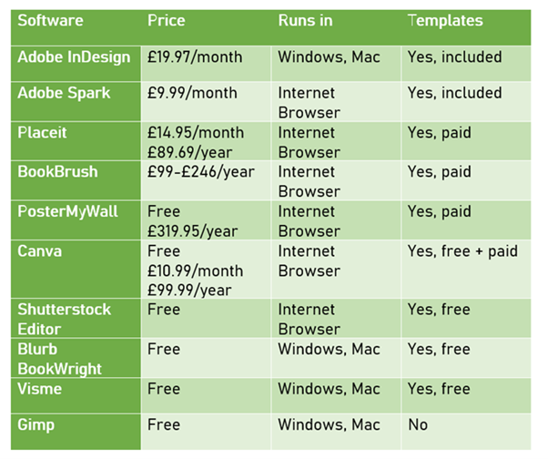
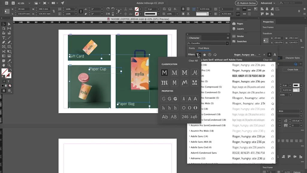
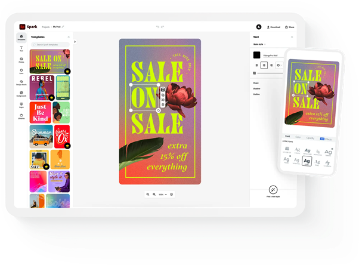
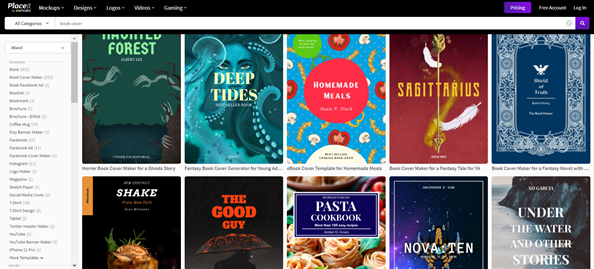
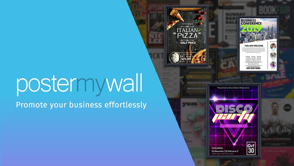
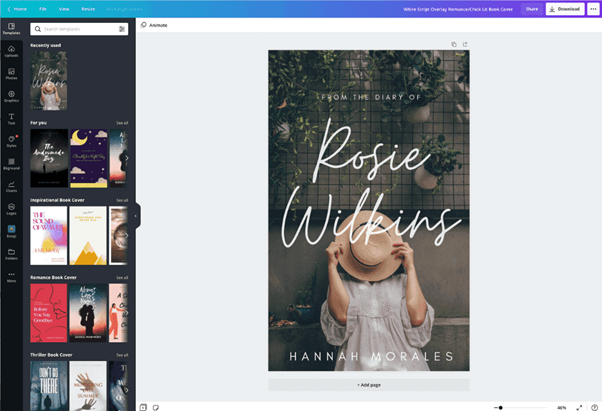
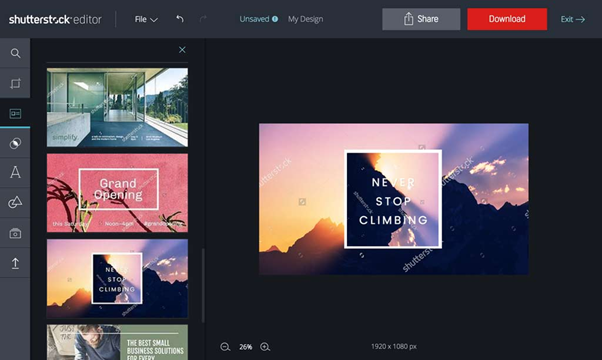
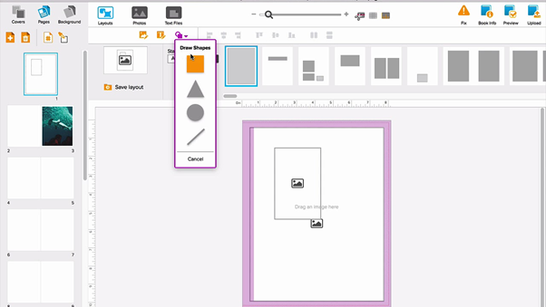
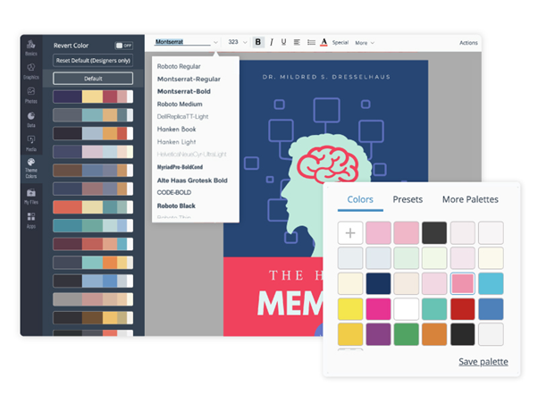
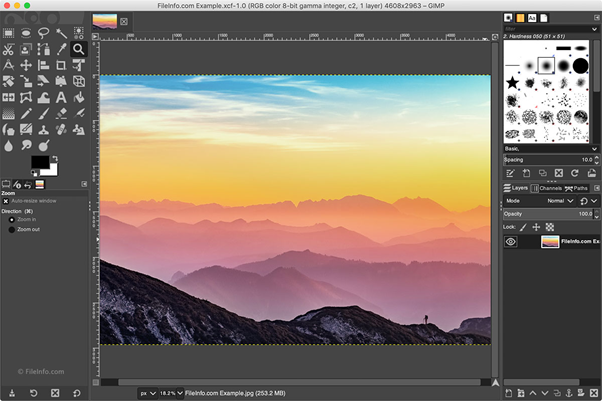

<!--StartFragment-->

If you want to create a professional and good looking book cover, the first place to start is finding the right design software for you. 

The cover designer[ Ninai Freitas](https://reedsy.com/ninai-freitas) claims that “It’s better to have a well-designed cover that can help increase sales”, and that in order to do this you “need to have the best tools- such as Photoshop, Illustrator or InDesign”. However, we don’t all have the budget for the top end Adobe Creative Cloud, so this list aims to show you a mixed variety of design software with a range of price tags- and some options which you can use completely free!

This overview will help give you a good understanding of the best software available, showing you both the pros and cons of each programme.

# Paid for Cover Design Software

### 1. Adobe InDesign (£19.99/month, Free Trial)

Whilst it’s undeniable that Adobe Indesign is an amazing tool which can create beautiful designs, it’s definitely a tool for professionals. There is a steep learning curve if you want to use this software, but with that also comes an extremely powerful tool good enough to create even the most professional of covers. However, there are thousands of free tutorials online teaching you to use this software, so don’t let its complexity turn you off! Adobe has even created its own thorough step by step guide on how to create your book cover[ right here.](https://indesignskills.com/tutorials/book-cover-tutorial/)

Once you get a hang of this software, it can be used for countless other things, such as formatting the inside of your book, creating advertising material, and other graphics. This software gives you precise control over  the page sizes, typography design, and an extensive variety of export options. You can also use this software to create an ebook version of your book, and even make it interactive!

### 2. Adobe Spark (Free, £9.99/month)

Adobe spark is a both popular and free to use graphic design tool. It has lots of templates that give you a good base to build upon, allowing you to create a truly unique and professional cover. One of the main factors which makes this an amazing cover design software is the professionally designed fonts which you can access for free. This software has [tons of helpful tutorials ](https://www.adobe.com/express/learn/tutorials)for those new to design, as well as many images, colours, layouts, fonts, and tools for adjusting them all, giving you unlimited freedom to create.

The one downside to this software is that the free version does leave a watermark on your finished cover, and unless you plan to use this software to create more book covers or promotional material in the future there are plenty of other free design softwares available that do pretty much the same as this one.

*Remember when using premade templates to pick one which fits the dimensions of your book!*

### 3. Placeit (Free, £14.95/month, £89.69/year)

Placeit is another design software which offers many book cover templates, with tools that allow you to turn them into your own original cover. Arguably the best feature of this software is the ability to search through cover templates based on genre, allowing you craft a unique cover perfectly targeted towards your audience.

Placeit also boasts a large selection of photos, illustrations, textures and graphics, meaning everything you need for your cover is all in one place.

If you do use the free version, there is a £8 fee to download your cover at the end, so this service does not really come for free, however it’s a good place to start planning your cover for free, which you can then recreate using one of the free softwares listed below.

### 4. BookBrush (£99-£246/year)

BookBrush is unique in that it’s specifically designed to be used by authors for all types of book related design, from adverts to book covers. Using the software you’ll get the feeling that they put a lot of thought into making this design software as intuitive as possible for authors new to design. 

Book Brush features three cover design tools: the 3D Cover Creator, the stand alone Cover Creator, and the Box Set Cover Creator tool. If you need a little help getting started with your design it also features 500+ templates specifically designed for book covers.

The one downside to this fantastic tool is the tiered pricing plan, meaning that the more freedom you want with your cover design ,the more expensive it’s going to be.

### 5. PosterMyWall (Free- £319.95/year)

PosterMyWall comes with a massive library of cover templates that can be customised and edited to suit your book. This service is connected to the stock photography websites Getty Images, Pixably, and Flickr, meaning you have access to a huge collection of photography and illustrations that can be put right onto your cover. They also show you the terms and conditions for the use of each stock image, so you can be sure that the photos you’re using are available for book covers and commercial use. Downloading the stock photos for free gives you a low resolution image, however you can pay around £5 for a high resolution version.

# Free to use cover design software

### 6. Canva (Free, £10.99/month, £99.99/year)

In my opinion, Canva is the number 1 free book cover designer. This web-based design software caters perfectly to its users needs, in both variety of templates, images, illustrations and icons, as well as accessibility for people new to design.

This software comes with thousands of stock photos and templates, not only just for book covers (although their cover selection is large), but also things such as adverts, posters and more, making advertising for your book easy. You can also customise each template with your own fonts, pictures and assets, meaning you can make something completely original. 

Canva is refreshing with how modern its designs are, with their templates always keeping up with modern book cover trends.

The only issue with Canva is that you can end up with a pretty generic book cover if you don’t put in the work. Whilst it may feel easy to pick one of their preformed professional templates and feel finished, remember that many other people will be using the same templates for their covers! Always use the templates as a starting point, and make it your own original cover from there.

### 7. Shutterstock Editor (Free)

This web-based design tool runs alongside the Shutterstock website, and as long as you have a Shutterstock account you’ll be able to use this software. This means that alongside this easy to use template based design software, you’ll have a massive library of stock photography and illustrations available to use for your cover.

If you’re looking for a quick and easy professional cover this site will be good for you, however if you’re looking to create something a little more complex this may not be the best fit for you.

### 8. Blurb BookWright (Free)

This free book layout software is incredibly useful for the whole book creation process, including cover design and text formatting. You can use this tool to design the layout of text within your book, and can easily convert the same file into an ebook version without any fuss. They even offer a free ISBN number creator, perfect for any authors looking to self publish their work! Among the free options this service gives you the most flexibility to create a unique book- from front cover to back.

This programme is also compatible with most Adobe software, and can be used across portable platforms through an app, making it the perfect tool if you’re working as a part of a team, or like to change around from desktop to tablet often.

Although this software comes with many free tutorials, if you don’t need/ want to learn all the text formatting tools which come with it, you can look elsewhere for free design softwares dedicated just to cover design. 

### 9. Visme

Visme is a web-based design software, which includes a large library of assets and templates to help you create your book cover, and also allows you to upload your own photos and fonts.

There are many options for customizing your cover, for example you can create your own palette, or even extract an automatically generated colour palette from a picture you upload. They have a selection of shapes available to help you design original illustrations and icons. Although this software comes with a large selection of tools and templates, they are all easy to use and intuitive, making it easy to create an original book cover.

### 10. Gimp (Free)

The nice thing about this software is that it’s the only service which is actually 100% completely free! There's no hidden fees for template or image access, no payment tiers for access to better tools, and you can even download your cover at the end for completely free.

Gimp is commonly known as the free alternative to Adobe Photoshop, and as you may guess, just like Photoshop itself there is a big learning curve for using all the tools available with Gimp. However, there are many free online tutorials, so learning to use this powerful and free tool is completely within reason. 

Once you do get the skills down, you’ll have complete freedom to create an original cover, much more so than with a template based software. Whilst it doesn’t come with templates or stock images to choose from, this does allow you more creative freedom as you’ll have to source these assets yourself.

Gimp is a service best suited to those who want to dedicate time to learning how to design, however if you only want a service which will help make your cover for you, this is not the best option.

Once you do get a grasp of GIMP, you can design more freely than with template-based book cover design software. However, unlike the basic web apps, it doesn't come with built-in image assets to choose from. You'll have to find your own — but then again, that can be part of the fun.

*Hopefully this guide has helped you pick the perfect design software for you, and given you the tools you need to make a professional and unique book cover!*

<!--EndFragment-->