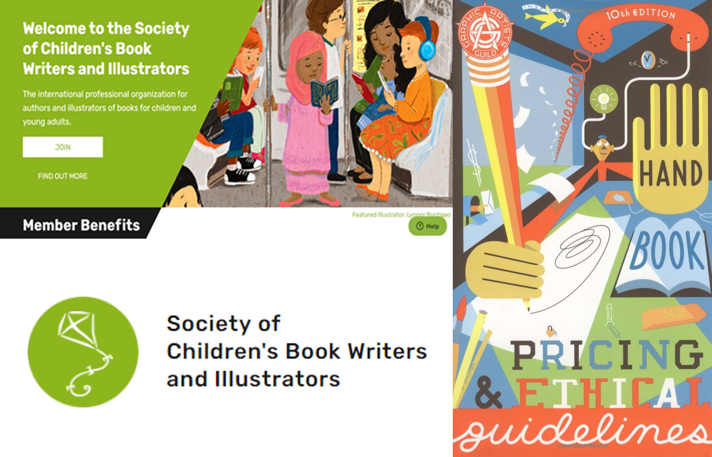
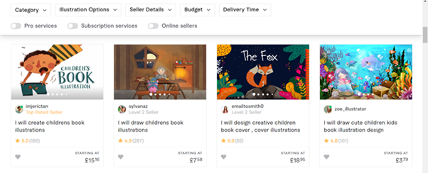

<!--StartFragment-->

# Why should you hire a book illustrator?

Illustrations on your book cover is a good way to make your book stand out, making it unique and original. Whether you want to hire an illustrator for your book cover, or to create a whole set of illustrations for the inside of your book, a professional illustrator can make beautiful, eye-catching artwork which will elevate your book design to the next level.

Already know what you want from an illustrator? Check out these professional illustrator agencies with a wide selection of artists:

* [Reedsy](https://reedsy.com/hire/us/illustration/)
* [Indie Book Launcher](<https://www.indiebooklauncher.com/ https://indiebooklauncher.com/services/cover-design.php>)
* [The Cat Agency](https://catagencyinc.com/)
* [White Magic Studios](https://www.whitemagicstudios.co.uk/book-illustration-services)
* [KJA Artists](http://www.kja-illustrators.com/welcome)
* [Beehive Illustrators](https://www.beehiveillustration.com/)
* [Fiverr](https://www.fiverr.com/)
* [Hire An Illustrator](https://www.hireanillustrator.com/i/)
* [BookBildr ](https://www.bookbildr.com/)

## How to find an illustrator for your book

If your search for an illustrator has only just begun, don't worry- I’ll show you how to find the perfect artist and help you get started creating the perfect cover for your book! Here are a few pointers on how to start your search.

* Know what kind of illustrations you want. Before you even contact the artist you must know if you just want an illustrated cover, or if you plan to have illustrations throughout the inside of your book too. If you plan on commissioning a lot of illustrations, how many do you want, do you want them to be detailed or simplistic, do you know exactly what you want for each one? By making the scale of the project clear from the get go, you’ll have a much easier time finding the right illustrator who is prepared for the job.
* Narrow down your search by looking at illustrators who specialise in your books genre or style. For example, if you want an illustrator for your romance book, look for someone who has done artwork like this before, and not say, someone who specialises in horror artwork. The right artist will be able to create a cover that readers expect to see, whilst also keeping it unique and specific to your book.
* Search for illustrators within your budget. Once you’ve compiled a list of artists who you like and would suit the genre of your book, you need to consider the cost. When reaching out to professionals, always be polite (I’ll talk more about how to correctly message artists in a bit), and be honest about your maximum budget. However, don’t rule anyone out because they look too expensive for you, it’s always worth requesting a quote even if you're not sure, you may even be pleasantly surprised!
* Once you’ve hired the perfect illustrator, you have to keep communicating with them! Just because you’ve hired someone amazing who will no doubt create you a stunning front cover, your work isn’t over yet. This is doubly important if you’re commissioning a lot of illustrations, as you’ll want to keep in touch and know how the project is coming along. Generally illustrators will happily share the progress they’ve made, and by keeping regular tabs on the project you’ll be able to make sure their creative vision aligns with what you want for your cover, keeping the whole project from going awol. 

## How to reach out and communicate politely with an illustrator

* Know their name. On a professional agency website the name of the artist should be clearly displayed, however if you're hiring someone from a website such as Twitter or Instagram and their name is not easily findable, search around a bit. It’s bound to be on one of their posts, or in their email address. Addressing them by their name will let them know that you’re serious about your inquiry, and lets them know you aren’t a spam email, which tend to lack a name in the title. It’s also just polite and sets you off on the right foot for your professional working relationship. 
* Introduce yourself. Saying ‘Hello my name is…’ is a much more professional way to begin than launching into the business side of things. Think about it, if you were speaking face to face you would always exchange names and pleasantries before talking about business, just because you are speaking online does not mean manners don’t matter. An inquiry is the first contact between you and your potential future artists, so try and make a good first impression.
* Be clear and know exactly what you want. You need to clearly express to the artist what your project is and how much work you expect from them, otherwise they will not be able to give you an estimate of the price. Be specific, describe what you want them to do, rough number of pages you want illustrated, if you want colour or black and white, detailed or simple illustrations, your deadline and budget. An artist can only give you an estimated price if they know the work they will be doing.
* Remember they are a person. Hiring an artist is not like hiring other impersonal services like food delivery or a car wash; just because you are willing to pay them for a service does not mean that they have to accept. Try to give them a simple description of your book to let the artist know if it’s a project they want to work on, or if their art style will fit the project you are planning. 
*  Know the artist's work. Before you send in an inquiry make sure to have an extensive look through the artist's portfolio. If you like their art style, but don't find anything close to what you would want them to make for you, they may not be a good fit. For example, if they specialise in portraits but you want them to make a landscape nature drawing for you, they might not accept the commission, wasting both your and the artist's time.
* Remember this is a partnership. Whilst it is your cover they are designing, during the creative process they may have inputs as to what would make the cover good, and what they can bring to your design. If you tell the artists that they are to stick to your design and make no changes whatsoever, they may not be as excited to work on your project. If you allow for their input on your cover you may end up with an even better end product- they are the experts after all!
* Know what your budget is. It is never acceptable to ask an illustrator to work for free, and asking them for a discount on work they have already quoted may just annoy them, making them not want to work on your project. Illustrators spend lots of time and money going to school, honing their skills and building their portfolio. You wouldn’t be happy if someone came to you asking for you to write them a book for free! All good work comes at a price, and artwork is no exception. Know what the average cost of illustrations costs before you contact an artist, a good place to check pricing is the Graphics Artists Guild Guidelines or the Society of Children’s Book Writers and Illustrators website.

* Making an initial payment. When hiring an artist to make you an illustration, be prepared to put down an initial payment. This will ensure that you have actually booked the artist’s time and work, and they can put you on their schedule to complete your project once they know you’re serious. This payment is also to protect the artist in case for some reason you have to back out, and they have already completed some of your project.
* Be prepared to work with a contract. This is to protect both you and the artist, and will make sure you don’t run into any legal trouble further down the line.

## How much does hiring an illustrator cost?

According to the indie publishing site Reedsy:

> “A professionally illustrated book cover will cost, on average, between $500-$1,500. A fully illustrated book, as you’d expect, is much more expensive — more like $2,000-$10,000, depending on the scope and complexity of the artwork.”- [Reedsy](https://www.blurb.com/blog/how-to-hire-an-illustrator/)

And according to the book blog site Book Beaver:

> “Generally speaking a cover based on stock images and photo manipulation will cost between £270 - £450. Book covers based on illustrations can cost anything from £500 - £1300 depending on the complexity of the artwork.”- [BookBeaver](https://www.bookbeaver.co.uk/blog/book-cover-design-costs)

If you only want simple small illustrations every so often within your book, for example at the beginning of each chapter, you’re looking at a cost at the lower end of the £500-£1,300/£1,500 range. However, if you plan to have a fully illustrated children’s book with full-page coloured illustrations, you can expect a price at the higher end of that budget. 

Pricing will of course also vary because of the artist's experience, someone new to design selling commissions on a site like Twitter, Instagram or FaceBook will probably charge less than a professional veteran of the industry. Therefore if you’re on a tight budget, you may want to seek out someone at the relative beginning of their career, who while may not be at the same level as some more experienced illustrators, can still offer you a stunning professional book cover for a lot less.

Of course, if you want to keep it even cheaper, you can hire a book illustrator from somewhere like Fivver where illustrators will sell their work for very cheap, however these illustrations tend to be used more than once or are templates leading you to have a non-original book cover, and the quality won't be as professional.

*I hope this guide has been helpful, and it’s given you the information you need to hire an illustrator for your cover!*

<!--EndFragment-->