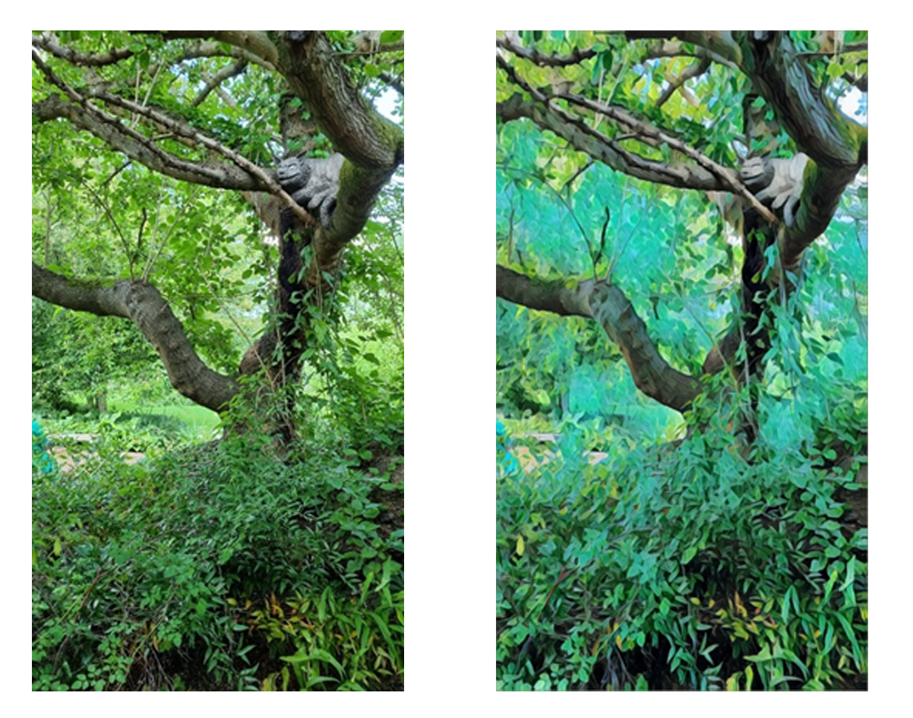

<!--StartFragment-->

When dealing with a book we’ve poured our heart and soul into, we all wish that we had the budget to hire an illustrator to create a cover which reflects how good the book is inside on the outside. However, if you don’t have a budget which can scratch that far, or a publishing house behind you willing to pour their money into your cover, you’re going to have to take things into your own hands. 

If you’re determined to have an illustrated cover, fortunately there is a good range of free resources online which you can use to source original good quality illustrations. Here are six of the best resources you can access for free!

## BookBildr

[BookBildr](https://www.bookbildr.com/) is a book building service which offers free illustrations and pictures, and tools to allow you to write and design each of your book’s pages. They have a large collection of bright and charming photos and illustrations you can use for your cover as well as inside your book. According to their website:

> “All of the graphics are available for commercial use without attribution, which means you can safely use them for practically any project.”- [BookBildr FAQ](https://www.bookbildr.com/faq/)

This service is perfect for you if you plan to have illustrations throughout your book, as well as your front cover. Whilst the design process is free and you have access to a large library, you do have to pay a small fee ($4.30) to download the pages at the end.

Once you have designed your cover, you can either download the pages as a PDF, or have your book printed and sent to you by BookBildr, for a reasonable price. Check out the pricing on their webpage [here.](https://www.bookbildr.com/design/)

*Check out this video to see how easy designing your book with BookBildr can be:* 

<iframe width="560" height="315" src="https://www.youtube.com/embed/rLQAF0NxUS0?rel=0" allow="accelerometer; autoplay; encrypted-media; gyroscope; picture-in-picture" allowfullscreen></iframe>

## Prisma

Prisma is a free to use mobile app that can easily transform the most basic photo into stunning images. Just upload a photo from your library onto the app, select a filter and see what works for you.

If you lack the skills to make your own illustrations then this app is a perfect alternative, turning your photos (or even a stock photo you purchased) into what looks like a hand drawn image.

Take a look at this photo transformation I’ve done using the Dallas filter:

*You can see how easily the edited photo could be turned into a book cover, which would be completely original and unique.*

## Absurd Design

If you’re looking for something quirky and a little bit weird for your book cover, [Absurd Design](https://absurd.design/) may be perfect for you. They offer a large gallery of hand-drawn illustrations which will make people look at your book twice.

Their illustrations are free to download, however they do require you to give credit to the artist if you use them for your book. However, it will be easy to add a credit page at the beginning or the end of your book, and it’s well worth it to use these charming little illustrations!

> “You're free to use these illustrations for both personal and commercial projects. And if you want to make a human happy would be nice to give credits by mentioning this website or be my supporter.”- [Absurd Design](https://absurd.design/)

## Freepik

[Freepik](https://www.freepik.com/) offers a selection of both photos and vector images, which are easy to use and free to download. They also offer premade ‘collections’ of images if you want a neat and cohesive theme for your cover. Whilst most of the images are free, you do ask that you include a credit to Freepik within your book.

## Creative Market

[Creative Market](https://creativemarket.com/) is a little different than the other resources, as you do have to pay for a majority of the content on this website. However, if you sign up for a free account, you will receive an email each week with a collection of illustrations, images and icons, all free to use. These resources are often from up-and-coming designers, so they are perfect if you’re looking for an original and unique illustration for your cover.

## Ouch!

[Ouch! ](https://icons8.com/illustrations)is a resource website created by icons8, featuring a massive collection of illustrations and images you can use for your cover. They are primarily intended for business use, however the colourful and unique illustrations will fit perfectly on your book. They also require you to credit them for the free use of their resources, however this is more than a fair pay-off for access to their massive gallery!

*I hope this list has given you lots of inspiration for your book, and that one of these resources will help you create a unique and stunning cover!*

<!--EndFragment-->