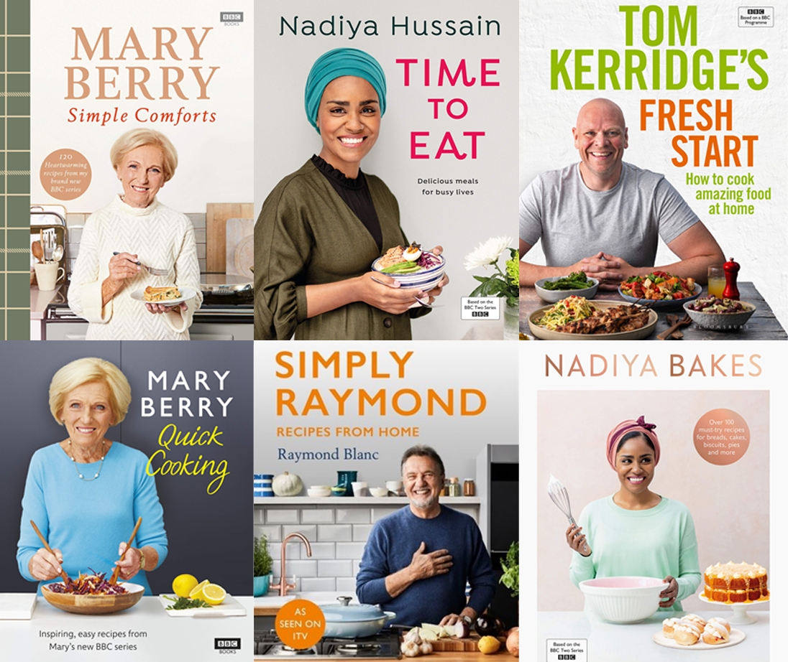
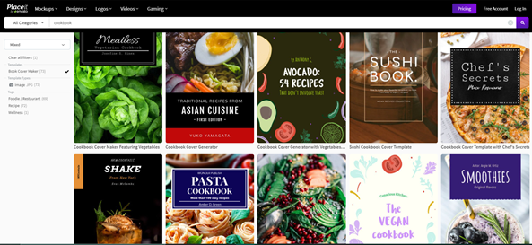
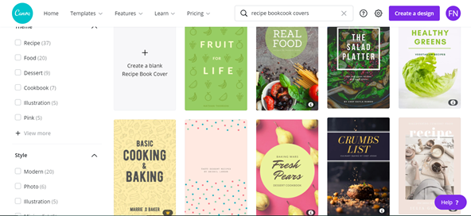
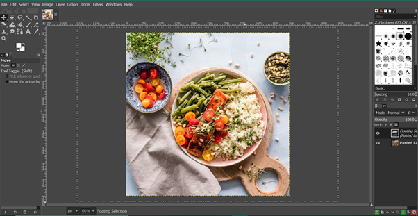
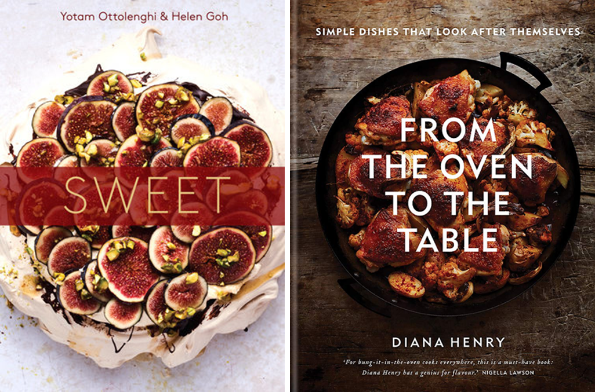
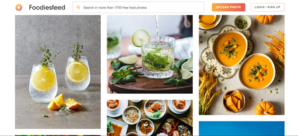
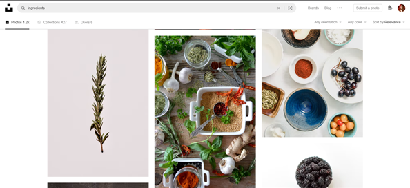
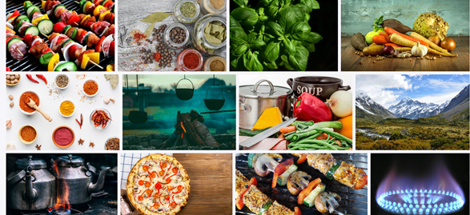

<!--StartFragment-->

Looking for inspiration for your cookbook cover, but have no idea where to start? Don’t worry! In this post I will show you multiple ways you can make an original, stunning and professional cover for your cookbook, in a cheap and affordable way.

# Book cover design software

There are many options for software which can create the perfect cookbook cover, often coming with templates, stock photos, premade colour palettes and typography packs, as well as many more features. 

For a comprehensive list of book cover design software check out my **[article here](https://threeseconds.netlify.app/2021/09/22/book-design-soft-top-10-best-apps/)**. However, I’ll go through a few of the best options for cookbook covers:

### Placeit (Free, £14.95/month, £89.69/year)

Placeit is a design software which offers many book cover templates, with tools that allow you to turn them into your own original cover. Arguably the best feature of this software is the ability to search through cover templates based on genre, meaning you can easily access hundreds of templates perfectly suited to your cookbook.

Placeit also boasts a large selection of photos, illustrations, textures and graphics, meaning everything you need for your cover is all in one place. As well as high quality pictures of food and drinks, you can find many illustrations which will elevate your cover to the next level.

If you do use the free version, there is a £8 fee to download your cover at the end, so this service does not really come for free, however it’s definitely worth the price for a professional and unique cover.

### Canva (Free, £10.99/month, £99.99/year)

In my opinion, Canva is the number 1 free book cover designer. This web-based design software caters perfectly to its users needs, in both variety of templates, images, illustrations and icons, as well as accessibility for people new to design.

This software comes with thousands of stock photos and templates, not only just for book covers (although their cover selection is large), but also things such as adverts, posters and more, making advertising for your cookbook easy. You can also customise each template with your own fonts, pictures and assets, meaning you can make something completely original, and even feature pictures of your own cooking.

Canva is refreshing with how modern its designs are, with their templates always keeping up with modern book cover trends.

The only issue with Canva is that you can end up with a pretty generic book cover if you don’t put in the work. Whilst it may feel easy to pick one of their preformed professional templates and feel finished, remember that many other people will be using the same templates for their covers! Always use the templates as a starting point, and make it your own original cover from there.

### Gimp (Free)

The nice thing about this software is that it’s actually 100% completely free! There's no hidden fees for template or image access, no payment tiers for access to better tools, and you can even download your cover at the end for completely free.

Gimp is commonly known as the free alternative to Adobe Photoshop, and as you may guess, just like Photoshop itself there is a big learning curve for using all the tools available with Gimp. However, there are many free online tutorials, so learning to use this powerful and free tool is completely within reason. 

Once you do get the skills down, you’ll have complete freedom to create an original cover, much more so than with a template based software. Whilst it doesn’t come with templates or stock images to choose from, this does allow you more creative freedom, and you can easily upload either a stock photo or your own photography to make your cover more original.

Gimp is a service best suited to those who want to dedicate time to learning how to design, however if you only want a service which will help make your cover for you, this is not the best option.

Once you do get a grasp of GIMP, you can design more freely than with template-based book cover design software. However, unlike the basic web apps, it doesn't come with built-in image assets to choose from. You'll have to find your own — but then again, that can be part of the fun.

# Using stock photography

Stock photography is a great way to make your book look professional, whilst also not breaking the bank to source images. There are many websites that offer free stock photography, however even the images you have to pay for are never very expensive. 

**[(However, do be aware of the rules of using stock photography before committing to it, check out my post here about how to use it correctly)](https://threeseconds.netlify.app/2021/09/22/how-to-properly-use-stock-photos-for-your-book-cover/)**

Many of the best selling cookbooks out on the market today feature high quality images of food on the cover, and it’s a great way to let potential readers know exactly what kind of food or drinks your book contains.

### FoodiesFeed

This one is pretty self explanatory, [FoodiesFeed](https://www.foodiesfeed.com/) is a free to use database specialising in photos of food. You’re bound to find many delicious looking photos perfect for your cookbook cover here!

### Unsplash

[Unsplash](https://unsplash.com/) is a large database of free, high-resolution photos. It has some truly excellent and professional royalty-free images available, and a large selection of food photography, many of which are bound to be a perfect fit for your cover.

### Pixabay

[Pixabay](https://pixabay.com/) is a popular site for professional designers due to the vast variety of images available, including photos, vectors and illustrations. Their content is produced and released under their own license, meaning you can use their images without permission and completely for free. While you aren’t required to credit the artist under the terms of service of the website, it’s still good practice to do so.

# Using your own photography on the cover

It’s always a good idea to feature your own cooking on your cookbook cover, as it shows your potential readers exactly what kind of cooking you do. However, if you're new to photography, or think that your own photoshoot would be too expensive, here are a few articles which can help you.

* [How to plan a photo shoot for your book cover, on a budget](https://melyssawilliams.com/how-to-plan-a-book-cover-photo-shoot/)
* [Beginners tips to book cover photography ](https://brutallyhonestmicrostock.com/2019/08/06/7-tips-on-getting-started-in-book-cover-photography/)
* [Ideas for book cover photoshoots, and how to get the right kind of image](https://digital-photography-school.com/shoot-images-for-book-covers/)

*I hope this list has been helpful for showing you how you can make your own cookbook cover for cheap, and that it's given you the tools and resources to create something unique and professional!*

<!--EndFragment-->