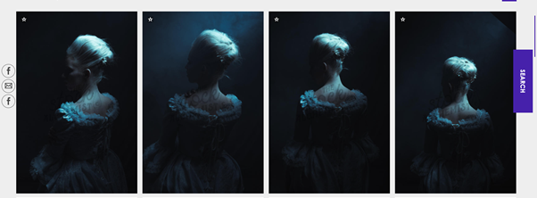
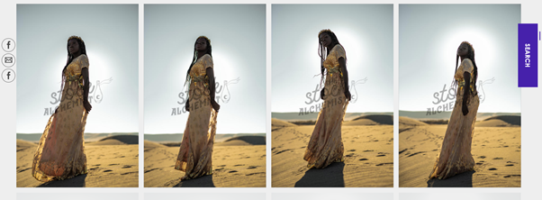

<!--StartFragment-->

Want to create a cover for your historical fiction book but have no clue where to start? This post will cover the top current trends in this genre, and show you how you can use them for your own cover.

According to Nielsen Book Scanner, Historical fiction has been on the rise the last 5 years, with sales increasing from £24,419,453 in 2018 to £27,539,501 in 2019, an increase of over £3.2 million.

However, with this increase in sales comes a whole sea of book covers you have to compete with in the marketplace. I’m going to show you the top current trends in the historical fiction genre, and how you can use them for your cover to make something both professional and unique!

# Trends in historical fiction covers

### Floral Details:

A central motif of historical fiction books in 2021 is flowery borders and illustration, reminiscent of old wallpaper or artwork. This design often gives the book a classy and romantic feel, with associations to art, royalty, delicacy and nature. If this design appeals to you, try looking at museums or historical archives to find inspiration on this type of design, hopefully you will find something which you can adapt for your cover

If you plan on hiring an illustrator, this decorative design would be a good way to have colourful flowery illustrations contrast with the rest of the cover, making your book stand out in the marketplace. 

However, if you are designing your book yourself, **check out my article here about how you can illustrate your book for free.**

### Using stock models:

As you can see above, a very common theme for historical fiction is using real people on the cover, often in historical clothing appropriate for the era of the story. This acts as a good indicator to the reader what genre the book is, and what time period it’s based in. For example, Conn Iggulden’s The Gates of Athens clearly shows that the book is both about war, and Ancient Greece, quickly drawing in its intended audience. Using a real model on the cover also gives us (the audience) a sense that it’s a serious story with real people, something which an illustrated or more cartoony cover may not convey.

If your interested in using real models for your book cover, **check out my post where I explain how to use stock photography properly.**

However, here are two examples of stock photography websites you can use for character images.

**1. [The Stock Alchemist-](https://www.thestockalchemist.com/)** specialising in historical, fantasy and sci-fi, The Stock Alchemist boasts a diverse set of models in a huge array of costumes and photosets. They are very reasonably priced and have good quality photos.

**[2. Period Images-](https://www.periodimages.com/)** Much like The Stock Alchemist, Period Images specialise in character stock photography, however they focus more specifically on historical characters from many different eras. They also have a lot of couples photography, so if your book is a historical romance this site may be a perfect fit for you!

### Historical Imagery:

* [The Folger Shakespeare Library](https://www.folger.edu/) is an amazing resource, with thousands of high quality images of original Shakespeare texts and illustrations, many of which would fit perfectly on a historical cover. The best bit, it’s all free for commercial use and publication, “with a [CC-BY-SA license](https://creativecommons.org/licenses/by-sa/4.0/)”[\-(folger)](https://www.folger.edu/images-and-permissions), which means that you can

> **Share**- copy and redistribute the material in any medium or format
>
> **Adapt**- remix, transform, and build upon the material for any purpose, even commercially
>
> [\- Creative Commons](https://creativecommons.org/licenses/by-sa/4.0/)

All that you’re required to do is give credit to the original source of the image somewhere in your book.

* [Arcangel](https://arcangel.com) is a stock photography website specialising in book cover photos, which allows you to sort by genre, perfect for finding pictures appropriate for your cover. Even better, they allow you to sort by historical era, allowing you to find a high quality image which is perfect for you. 

## Genre appropriate typography:

The font you use for your cover can be the difference between the success of your book and the failure. While it is possible to use a fun and unique font, it’s hard to tread the line between stylish and tacky, and so more often than not books tend to take it safe with a nice bold font, making the book look timeless and professional.

For example, take a look at Conn Iggulden, The Gates of Athens. The original title is simple and clear, but effective. However, I’ve changed the font used on the title into a stereotypical old fashioned handwritten script font, one which you may expect to find on a historical fiction book. 

You can see how this font does not work with this cover, even though it may work with other covers. Your font has to suit the cover of your book, both thematically and stylistically. The Ancient Greek soldier on the cover of this book starkly contrasts with the romantic script font, making it look unprofessional. In this case, the more simple bold font works for this cover, allowing for the picture to be the main focus instead of the title. 

However, if you do want to use a more original and stand out font, here are a few examples where historical fiction books have done this well.

Each of these fonts relates in some way to the content of each book, making it a deliberate stylistic choice instead of a random pick of font. For example, Bernard Cornwell’s Fools and Mortals uses the script font I tried on the cover above, however this time it looks more professional and deliberate as the book is about Shakespeare’s son, a subject which you would associate with script writing. Both Stephen Fry’s Troy and Robert Harris’ Munich use fonts which signify the time period they are talking about, making the font fit thematically with the rest of the cover, and also signifies to the audience what the book is about.

**Julie Karen** from the indie publishers website [JulieKaren.com](https://www.juliekaren.com/blog/should-my-photo-be-on-the-front-cover-of-my-book) says that:

> “Sometimes having an atypical cover can make your cover win, but often it can make it lose. The decision to make an atypical cover needs to be a decision made for a deliberate marketing reason.”- [JulieKaren.com](https://www.juliekaren.com/blog/should-my-photo-be-on-the-front-cover-of-my-book)

Therefore, if you do decide to use a non-standard font, either try to make it suit the theme of your book (e.g. the time period it’s set in, the overall style of your cover, the pictures or illustrations used on the cover), or make it the main focus of your cover, for example such as in A. J. Pearce’s Dear Mrs Bird, where the font does not look out of place despite its boldness, as the background remains plain and the title is the main focus of the cover. 

As long as your decision is deliberate, you have the space to be creative and use non-standard typography.

*I hope this breakdown of design trends in current historical fiction has been useful, and has helped inspire you to create an original, professional and stunning cover for your book*

<!--EndFragment-->