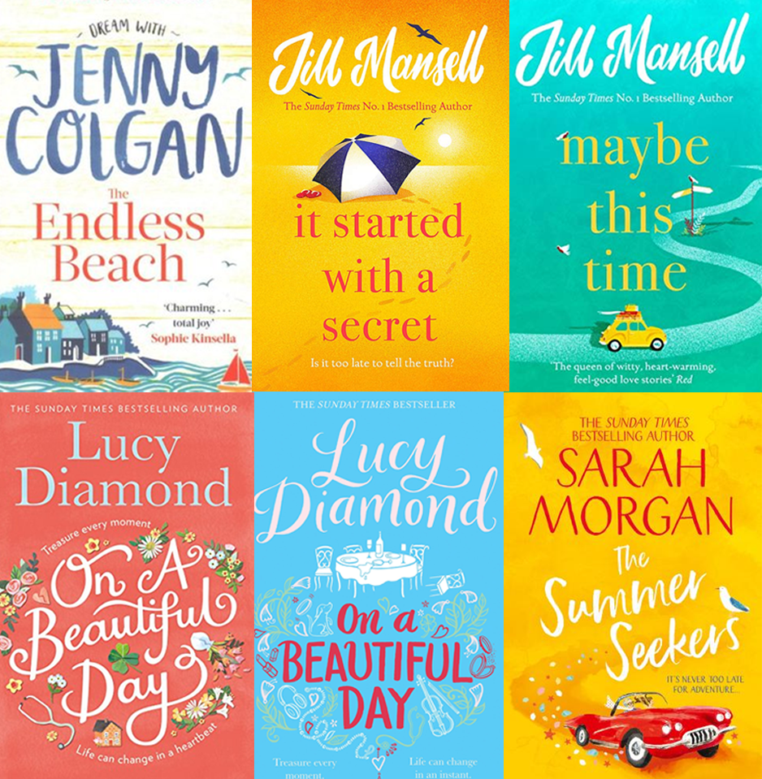
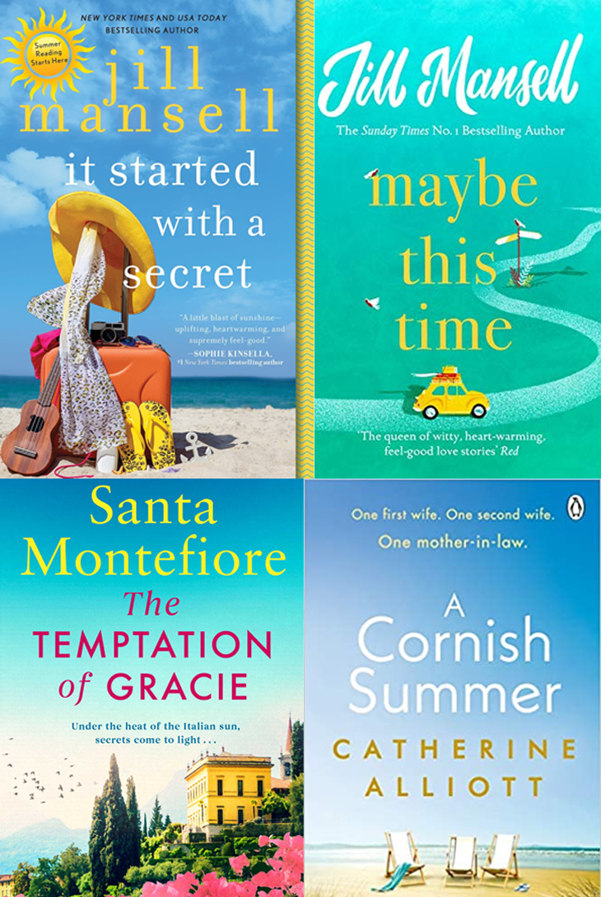

<!--StartFragment-->

Romance is a genre that will never go out of style, however, the cover design for this group of books is always changing and adapting to a new market. In this post I will show you some of the most current trends in romance cover design (from the top selling books of the last five years according to Nielsen Bookscanner), and how you can use them on your own cover.

# Using models

The use of real models is a massive trend in the romance market at the moment, with almost half the top selling romance books featuring real people on the cover (Nielsen, 2021).

These covers typically tend to feature pictures of things like a woman looking over her shoulder at the camera, or a headless woman in a gorgeous gown, or a woman walking off into the distance down a winding exotic street, all  being whimsical and charming.

Here are two examples of stock photography websites perfect for a romance fiction cover.

* **The Stock Alchemist-** [The Stock Alchemist](https://www.thestockalchemist.com/) boasts a diverse set of models in a huge array of costumes and photosets. They are very reasonably priced and have good quality photos.

* **Period Images-** Much like The Stock Alchemist, [Period Images](https://www.periodimages.com/) specialise in character stock photography, however they focus more specifically on historical characters from many different eras. They also have a lot of couples photography, perfect for a more romantic cover.

If you want an original model photo for your cover, and have the budget to organise a photoshoot, try checking out these articles here on how to do your own photoshoot for cheap:

* [How to plan a book cover photo shoot](https://melyssawilliams.com/how-to-plan-a-book-cover-photo-shoot/)
* [Tips on getting started in book cover photography](https://brutallyhonestmicrostock.com/2019/08/06/7-tips-on-getting-started-in-book-cover-photography/)

# Illustrated Covers

Having an illustrated cover is the perfect way to show your book is fun, contemporary and professional, as hiring a professional illustrator is a good way to create a stunning and original cover you can be proud of.

There are many different types of illustrations for romance covers, however here I have found three popular trendy styles which have dominated the romance book market.

* ### Simple illustrations with bold colours:

These books all feature simple designs with minimal details, however they do still stand out and look professional. This is because the colours used are very bold and loud, drawing the eye to the cover. They also typically have plain (although colourful) backgrounds, helping the simple illustration stand out and be forefronted. 

This style is very trendy and fun, and is bound to give your book a professional look.

* ### Modern style illustration:

Recent years have seen the rise to this specific art style, which you're bound to recognise and appreciate. The blocky style combined with sharp lines and minimal details will definitely give your book a contemporary feel, the perfect style for a fun romantic book set in current times!

* ### Sketchy and flowy style:

This style has been around for a while, a popular pick among modern romance fiction covers. The sketchy lines and detailed environments, combined with the bright white and pink colours give the notion of a fun and romantic world the book is set in. This style would be perfect for a contemporary book looking to show themes of humour, fun, romance and happiness.

# Typography:

Having the correct typography is essential if you want your book to look both professional and trendy, as the font you choose does a lot more than just look good on the cover. Having the wrong typeface on your cover can not only leave your book looking cheap and bad quality, but it can also confuse readers what genre and theme your book is, a disaster if you want your book to sell to the right market. 

Here I will go over the most common types of typography used on romance fiction covers, and what they imply about the books they are on.

* ### Romantic script font

This type of typography always gives a book a romantic and tender feel, perfect if your book is a lighthearted romance focused on happiness and finding love. 

However, be careful when using this type of font, as if done wrong it can leave your book looking unprofessional and cliche. Notice how on all these books they use a mixture of both winding romantic typeface, as well as tall bold letters to contrast with the other text. This gives the cover more balance, and makes the romantic font look well placed and deliberate, instead of just a cliche choice for a romance cover.

* ### Bold classy lettering 

This type of typography, with tall refined bold letters, often gives a book a classy feel, perfect for something like historical romance, or books about royalty. This typeface also tends to give off a mature romantic feel to its audience, instead of poppy younger romantic fiction as we saw above. 

If you’re unsure about what font or typeface to use, going for something understated yet bold like this is a guaranteed way to give your book a professional and expensive look and feel.

* ### Contemporary style typography 

If you want your book to fit in with the most current trends, using this type of typography is the perfect choice for you. This rounded and simple typeface has been seen across the book market in recent years, and it’s a guaranteed way to give your book a fun and youthful vibe.

# Colours

One of the reasons romantic fiction is so popular is because of its ability to bring emotions out of us and make us feel along with the characters inside the book. If you’re new to design, you may not realise how much of a link there is between colour and emotion, and in a genre so linked to emotions it's essential you associate the right ones with your cover. Using trendy colours like pastels and neons may seem like the best choice to make your book fit with current trends, however you need to pick colours which express the themes of your book, or you will leave readers confused about what your book is about- a disaster when trying to attract new readers!

If you want to more about the theory behind colours, **[Check out my post here.](https://threeseconds.netlify.app/2021/09/22/colours-how-they-affect-your-cover/)**

However, I’ll show you here a few examples of what colours do for your cover, and how you can use them to create a specific mood for your romance book.

* ### Dark colours

These books below all feature dark blues, greys and blacks, mostly with a hint of orange or red to contrast against the dark background.

This colour scheme makes the books seem mysterious and sexy, associations which you want your reader to have if your book is an epic emotional romance, however not something you want to have if your book is a light hearted rom com.

[Cover Design studio](https://www.coverdesignstudio.com/best-colors-book-covers/) claims that people typically see these colours as representing these things:

> * Red: passion, dominance, depth, expensive
> * Blue- sincerity, wisdom, sadness, calm
> * Grey- sophistication, knowledge, prestige
> * Black- authority, power, mystery, control, suspense

While you might not look at one of these books and think ‘knowledge and authority’, the colours do all work together to create a mood for your book that potential readers will pick up on, so it’s essential that you get them right!

* ### White and pink

White and pink colours can make your book look fun, innocent and cute, a good decision for any lighthearted romance. 

[Cover Design studio](https://www.coverdesignstudio.com/best-colors-book-covers/) claims that people typically see these colours as representing these things:

> * White- clean, simple, truthful, straightforward
> * Pink- youth, playfulness, innocence, emotion
> * Pale yellow- friendly, warm, approachable

* ### Bold exciting colours

Whilst these cover’s colour palettes might not seem to fit into a cohesive group, think about what you feel when you look at them. Each of these covers gives you a sense of exotic landscapes, nature, adventure and fun, as well as romance. 

[Cover Design studio](https://www.coverdesignstudio.com/best-colors-book-covers/) claims that people typically see these colours as representing these things:

> * Red- energy, enthusiasm, power, emotion
> * Orange- positive, dynamic, optimistic, confident
> * Bold yellow- ambition, creativity, edgy, motivation
> * Green- nature, health, environment, vitality
> * Blue- trust, thoughtfulness, calm, dependability

These colours would best fit an adventurous and fun romance novel, implying things such as happiness, exploration, sun, holidays and nature.

*I hope this breakdown of current design trends in romance has given you some direction and inspiration for your own covers, and if you want to know more about things such as stock photos, illustrations, colours and typography check out my other posts on this site!*

<!--EndFragment-->