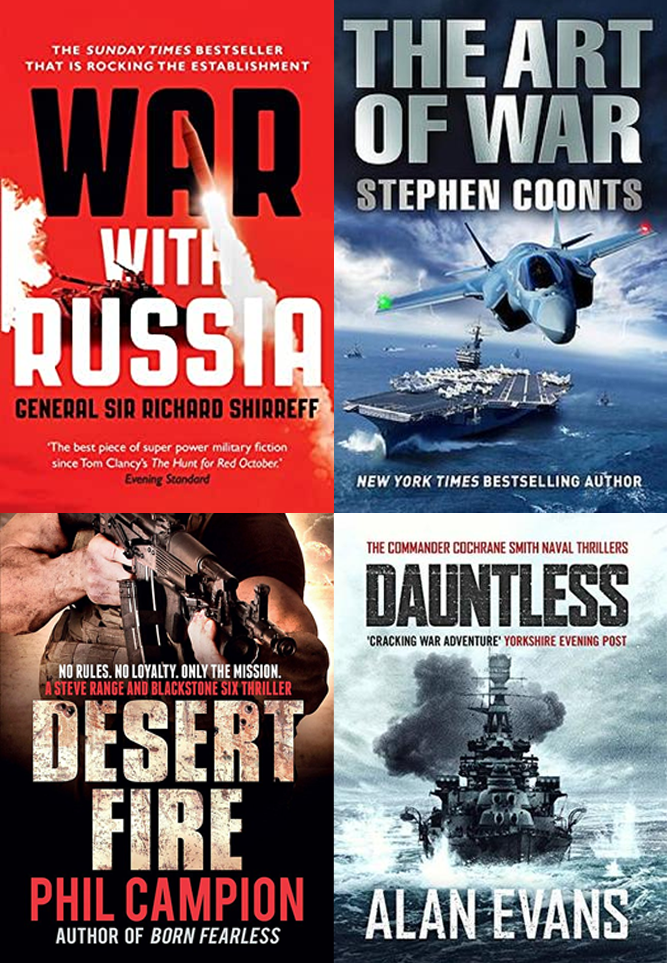

<!--StartFragment-->

Looking for inspiration for your war fiction book cover? Here's a list of some tips and resources you can use to create a unique and professional book cover.

# Start with finding sources of inspiration

Even the best of designers need to find inspiration before they can start creating their own book covers. If you’re struggling to start your cover or aren’t sure what designs are commonly used for war fiction covers, try researching the genre through websites such as these:

* **[99 Designs- ](https://99designs.co.uk/inspiration/book-covers/war)**this is a website dedicated to showcasing the best book cover design in the industry, and luckily for you, they sort their cover designs by genre. Take a look through this amazing collection of war fiction covers, and see if you can take some inspiration to make your own cover stunning and genre appropriate. 
* **[PosterMyWall- ](<httpswww.postermywall.com/index.php/posters/search?s=War%20Book%20Cover)**this is a design website which is very useful for making original book covers. This web based app comes with thousands of professionally made templates, stock photos, and illustrations which can help inspire your own cover
* **[Book Cover Designers- ](https://thebookcoverdesigners.com/war-book-cover-designs/)**this is a book design agency that specialises in indie and self-published books. They have a large catalogue of war fiction book covers they have previously designed for customers, so have a browse and see if any of these designs inspire you.

# Picking the right image for your cover

Obviously, this is a book about war, and you want potential readers to know that. Take a look at this picture from the war fiction section in Oxford Waterstones. 

*Notice anything in particular?* 

All these books include imagery of things such as, fighting, weapons, uniforms or war based vehicles, all clearly signifying the books are about war. Genre specific design is very important if you want the correct audience to be interested in your book, and helps you access new markets of readers who may not have heard of your books before, but are interested in war fiction.

*But how do you find the right images for your cover?*

Here are a two resources you can use to source high quality genre appropriate photos for your cover: 

* [**Arcangel-** ](https://arcangel.com)this is a free to use stock photo website dedicated to book cover photography, which allows you to sort images by book genre. Even better yet, they allow you to sort by specific war periods.

* **[Pixabay](https://pixabay.com/)** is a popular site for professional designers due to the vast variety of images available, including photos, vectors and illustrations. Their content is produced and released under their own license, meaning you can use their images without permission. While you aren’t required to credit the artist under the terms of service of the website, it’s still good practice to do so. They have hundreds of free to use images appropriate for war fiction, so you’re bound to find the perfect image for your cover on this site.

# Using the right colours

Getting the colours you use on your book right is essential if you want your book to look professional and fit within the marketplace. People associate a lot with colour, and if you were to use the wrong palette you could leave your audience confused about what your book is about.

Try looking at other war fiction books if you don’t know what's typical or appropriate for the genre. Here's a few examples from the top selling war fiction of the last five years (according to Nielsen Bookscanner).

* **Red and Black:** according to [Cover Design Studio](https://www.coverdesignstudio.com/best-colors-book-covers/), these colours are associated with things such as emotion, power, passion, depth, dominance, prestige, violence, authority, power, control, mystery and suspense.  

If you want your cover to imply your book is more action focused, as well as make it seem mysterious, dark and violent then this colour palette will suit your book perfectly.

* **Muted yellows, beige and grey:** these colours can give a more calm and mature theme to your book, suggesting it has a more historical focus rather than being an action book. According to [Cover Design Studio](https://www.coverdesignstudio.com/best-colors-book-covers/), they imply things such as calmness, knowledge, prestige, wisdom and sophistication.

* **Black and white-** Another colour palette you can choose is a black and white theme. According to [Cover Design Studio](https://www.coverdesignstudio.com/best-colors-book-covers/), these colours signify things such as authority, power, control, as well as themes of clean, simple and straight-forward.

For an example of this take another look at the Oxford Waterstones display of war fiction books:

A lot of these books feature black and white on the cover, giving them a classy and calmer tone. It also gives the books an older look, such as old fashioned black and white newspapers, signifying to the reader that they are about history as well as war.

# Typography that will fit your cover

Using the right font is essential for setting the tone of your cover, and signifying to the reader what kind of war fiction your book is. For example, is it historical or modern, calm or action packed, romantic or not?

For example take a look at these covers of Rosemary Goodacre’s books (two of the best selling war fiction books of 2021):

Whilst the imagery clearly shows us these are historical fiction books with themes of war, the typography also shows us that these books are about romance, with the curving script font and use of pink and red lettering. This choice is perfect for these books, however if your war book is a serious mystery novel, or an action packed fighting book, this choice would only confuse your audience.

One way to convey to your audience that your book is focused on action and fighting is to use a bold blocky typeface such as in the covers below. The typography of these books gives the impression they are serious and violent orientated, allowing them to be found by the exact right audience of readers

Another way you can use typography effectively is to create a branded design for your cover, which can be useful if for example you plan to have a series of books with similar covers. Check out Chris Ryan's series below for an example of this.

*I hope this post has been useful and has given you the knowledge and tools you need to create an original and professional war fiction book cover!*

<!--EndFragment-->