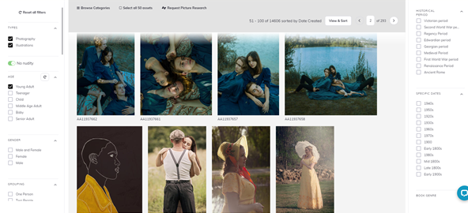

<!--StartFragment-->

Looking to make a unique and trendy young adult fiction book cover, but have no idea where to start? This guide will walk through the current trends of this genre and show you how to make a genre appropriate design. I will also show you the easiest and most useful design software available, that even a novice at design could use to create both a professional and stunning cover.

# Current trends in young adult fiction covers

### Illustrated cover

If you take a look at the young adult fiction section in any bookstore, something you are bound to notice is how almost all the books are illustrated. From super detailed fantasy epic covers, to more simple fun cartoonish covers for high school romance novels, these covers all feature stunning and unique illustrations. Take a look at these pictures of the young adult book section in Oxford Blackwells for an example of how varied the style of art used in this genre is.

If you plan to illustrate your own cover, try looking at other books within the genre to know what types of colour palettes, art styles and imagery are popular. Also check out my post here about how you can **illustrate your own cover as a novice- for free!**

Additionally, have a look at this super handy [article by Matthew Macdonald](https://writingcooperative.com/how-to-illustrate-your-book-for-0-e1a5fe89375d) if you want to use image manipulation to create your own original illustrated cover.

However, not all of us have the skills to create original illustrations, and sometimes things like these are best left to professionals unless you want to risk ending up with something unintentionally bad. 

Here’s a list of a few affordable illustration agencies, where you can browse a range of artists' portfolios and find someone perfectly suited to your book. 

* [Reedsy](https://reedsy.com/hire/us/illustration/)
* [Indie Book Launcher](https://indiebooklauncher.com/services/cover-design.php)
* [The Cat Agency](https://catagencyinc.com/)
* [White Magic Studios](https://www.whitemagicstudios.co.uk/book-illustration-services)
* [KJA Artists](http://www.kja-illustrators.com/welcome)
* [Beehive Illustrators](https://www.beehiveillustration.com/)
* [Hire An Illustrator](https://www.hireanillustrator.com/i/)
* [BookBildr](https://www.bookbildr.com/)

*Photo from  <https://catagencyinc.com/>*

### Using character images

Using model photography is also a very popular current trend among young adult fiction, allowing you to both show off the characters in your book as well as themes such as the time period, fantasy elements, location and the overall tone of your book. For example, check out these top ten best selling YA books from the last five years (according to Nielsen Bookscanner), see how each of the character photos set a tone for the book, allowing potential readers to know what the book is about just from the cover.

Stock photography is an amazing resource when you are making a book cover on a budget, and luckily for you there are many stock image websites dedicated to book cover photography. You’re bound to find the perfect character photo on one of those three sites:

* [**Archangel** ](https://arcangel.com/)actually specialises in book cover photography and illustration, even going so far as to organise their photo libraries by book cover themes and genres, even even better yet, you can organise by sub-genre, allowing you to find a picture perfect for your book.

* **[The Stock Alchemist’s](https://www.thestockalchemist.com/)** unique feature is that they create character photos for designers to use on book covers. They carry photos for many different genres, such as science fiction and dystopia. They also pride themselves on the diversity of their models; they have a whole section dedicated to gender non-conforming models.

* **[Pixabay](https://pixabay.com/)** is a popular site for professional designers due to the vast variety of images available, including photos, vectors and illustrations. Their content is produced and released under their own license, meaning you can use their images without permission. While you aren’t required to credit the artist under the terms of service of the website, it’s still good practice to do so.

  

If you're wanting to use a character photo but are still tied to the idea of having an illustrated cover, try using an image editing site/ app to give a stock photo an illustrated look. For example check out this stock photo I’ve edited for free using the Prisma app with the filter Daryl Feril. 

*Photo from <https://pixabay.com/photos/guy-bike-bicycle-lifestyle-adult-598180/>* 

# How to make your own cover

### Picking the right book cover design software for you

When it comes to design software dedicated to book covers, there are many options available, both paid for as well as free. They can be extremely useful tools for anyone new to design, as the intuitive and easy to use apps will help even a complete beginning make something both professional and stunning. If you don’t want to use one of the many templates available on these sites, you also have the freedom to upload your own images, or even to start your cover from scratch using something like InDesign or Gimp.

##### 1. Canva (Free, Pro-£10.99/month)

Canva is one of the most popular design software websites, with thousands of free to use templates, stock photos and illustrations. You also have access to lots of professionally made colour palettes and typography packs which you can apply to your cover design, giving you all the tools you need to make a professional and stunning cover. The search engine allows you to sort by genre, so you can browse a large selection of YA appropriate covers.

##### 2. Placeit (Free, £14.95/month)

Placeit is another design software which offers many book cover templates, with tools that allow you to turn them into your own original cover. You can search through cover templates by genre, so you’re bound to find something perfect for your book.

Placeit also boasts a large selection of photos, illustrations, textures and graphics, meaning everything you need for your cover is all in one place. 

#### 3. Shutterstock Editor (Free)

This web-based design tool runs alongside the Shutterstock website, and as long as you have a Shutterstock account you’ll be able to use this software. This means that alongside this easy to use template based design software, you’ll have a massive library of stock photography and illustrations available to use for your cover.

##### 4. Adobe InDesign or Gimp

If you want more freedom to create an original cover, either using an illustration you commissioned or a stock photo you’ve found, try using a software such as InDesign, or if you’re working on a budget there's the free option of Gimp. They are both image editing and design based tools, and while they both have a steep learning curve for a complete beginner, they are well worth the time learning if you want to get good at book cover design.

*I hope this guide has helped give you the tools you need to create your own young adult book cover, and that this list of trends has given you the spark of creativity and inspiration you need to make something professional, trendy and stunning!*

<!--EndFragment-->