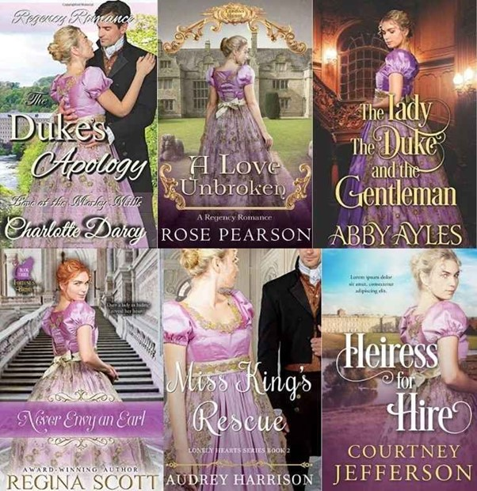

<!--StartFragment-->

 

Most authors understand that picking the right photo for your front cover can make or break the success of your book in terms of catching the reader's eye. However, a limited budget can make the cover of your dreams seem out of reach.

But don't worry! I’m going to show you how your cover can compete with the best in the market, whilst not spending a fortune. Using stock photos can seem overwhelming when faced with the thousands upon thousands of choices, however, I am going to break down how to find the right images, how you can use them for your cover, and how to avoid getting into legal copyright trouble whilst using them.

 

## What is a royalty-free stock photo?

 

Stock photos are professionally taken photographs or illustrations produced with the intentions of companies or individual clients licensing the photos for usage rights. Whilst you do purchase the rights to use the photo, the original photographer still retains ownership of the image, and you can use it within certain limitations.

## Paying for the photos

Whilst these images are referred to as royalty free, this does not mean they are FREE free. Sometimes stock photos and illustrations can be free, but more often than not you have to pay for the license to use them. 

The cost of these photos will vary depending on:

* Exclusivity: if you want to have exclusive access to the photo it generally cost a bigger sum
* Intended use: the price will fluctuate depending on whether you want the image on digital or physical copies, or whether you want to create merchandise and online advertising using the cover, etc.
* Volume: a standard license will usually allow you to print up to 500,000 copies of your book cover. Whilst this probably doesn't seem like an issue now, if you do have to print more than this in the future (you lucky thing!), you’ll have to buy a more expensive licence

 

If you purchase a licensing agreement with royalties (a “rights-managed” asset), you’ll have to pay the photographer a percentage of any profits the image makes in the future. This can be a huge financial hit if you’re an indie author with no funding or team behind you.

On the other hand, royalty-free licenses only require a fixed one time payment, unless you stumble across the perfect stock picture for free. Once the license has been purchased, you can use the image (within the agreed upon limitations) without fearing an extra charge further down the line.

Remember to be careful! Whilst you have purchased the license to use the image and there are no ongoing royalties, this doesn’t mean you own it. You’ve paid for the permission to use it, but you should always be aware of the terms and conditions in the licensing agreement, and be wary not to get into any legal trouble which can be costly.

*Always read the fine print.*

A quick reminder, the publishing site [Reedsy](https://blog.reedsy.com/book-cover-pictures/) says:

> “don’t forget you’ll also be paying your cover designer if you hire one, so be sure to factor that into your budget! Some designers will source the image for you, in which case you’ll be paying them rather than purchasing the rights yourself directly.”

## Pros and Cons of using stock photography:

 

Believe it or not, stock photos are used for professional book covers more than you’d think. Here are some of the reasons they are a good decision for your book cover:

1. They look good. The photographers behind these images are professionals, and even the worst stock photos are still better than what the average person could take
2. Huge selection of choice. If you use one of the bigger stock photo websites I discuss below, you can have access to millions of photos, meaning that you (or your designer) have the freedom to create a unique book cover
3. Cheap. Even the most expensive stock photo will be miles cheaper than orgasning a whole professional quality photoshoot.

Of course, there are a few risks to bear in mind if you’re considering using a stock image on your book cover: 

1. Copyright laws are serious. Make sure you read the fine print to keep out of legal trouble and to avoid paying additional fees; going against the license agreement is easier than you may think!
2. Be wary of getting scammed. Some sites are shaddier than others, with people uploading photos they don't actually own. Try and do a reverse image search on google to check where the image has come from, before committing to the photo. The last thing you want it to run into legal problems over the image on your books cover.
3. Try to pick an original, unique image. As most stock photos have no exclusivity, there’s no limit on how many people can purchase the same image. If you choose the first image you find, you run into the risk of having a similar cover as someone else. Don't just take my word for it, [take a look at this gallery of copies.](https://www.indiebooklauncher.com/resources-diy/gallery-of-clones.php)

*No, these aren’t all books in the same Romance Regency-era series, they’re six different books each by completely different authors. Whilst they don’t all share the same author, they do however, share the same stock photo shoot.*

While they may seem more original and better quality, oftentimes the ‘boutique’ (aka small) stock photo sites that create character photos for book covers will release a series of photos from the same shoot. You should be prepared for other book covers within the same genre as yours to have similar images on their covers.

 

## How to find the perfect stock photo for your book cover:

If you are still keen to use royalty-free stock photography for your cover, I’ve laid out below some tips to help you get the best out of your chosen image.

##### Choose the correct size

Size definitely matters when picking your book cover, and a general rule of thumb is to go bigger, rather than smaller. You can always shrink down a bigger image to fit your cover’s dimensions- but if you pick a picture which is too small and try to make it larger, you’ll end up with a pixelated image which will not look good on your cover. To know what size your book needs to be, [check out this article about standard book cover dimenions. ](https://blog.reedsy.com/book-cover-dimensions/)

##### Search lots of keywords

On stock photo website uploaders usually put tags on their pictures so people can search for them according to their content and theme. However, people will tag things differently according to how they view it, for example one person may tag a photo as ‘wildlife’, whilst another may tag it as ‘nature’; you may search for ‘historical romance’ and be given a romantic picture set in Ancient Egypt. (Probably not what you were looking for!) Try using multiple ways of phrasing what it is you want to make sure you don’t miss the perfect image.

##### Keep your cover in line with the genre of your book

What do you expect to see on a book typical of your genre? What kind of image or colour scheme will properly convey your book's tone to your target audience? You wouldn’t expect to see a cowboy hat on the cover of a new crime novel, and readers would be confused to see a smoking gun and blood on the cover of a cheesy YA romance. Don’t rush, dedicate time to exploring book cover designs and get some inspiration before jumping in and choosing the image for your front cover. You’ll benefit from having more direction, and knowing what type of cover your audience will be expecting to see. 

##### Don’t be afraid to be original

It’s in your best interest to avoid the most popular images which other authors are likely to have also picked, or your cover may end up lost in a pile of books with the same cover and genre as yours. A good way to tell if the image you’ve chosen has been used on another book cover is to try searching the tags of your chosen image, plus the term ‘book cover’. You should be able to find any relevant book covers that may be similar to yours, letting you know to avoid the image and pick something more original.

##### Editing is key to success

Now you’ve picked out your stock image, but your design process has only just begun. What you don’t want to do is plonk your unedited image onto your cover, add your name and book title and call it quits. Your image should not be the final product, but the basis for a new unique design. It’s the little details which make the biggest difference, such as typography and deliberate composition that will make your cover truly look professional and stand out.

 

*Of course, if you really don’t have any experience in design or making book covers, hiring a professional book cover designer is the best solution. A good front cover is essential to the success of your book, and a professional designer will make your cover, well, professional. Cover designers typically source stock photos and handle the licenses so that the final product they deliver to you will be a cover ready to publish. Some designers will be willing to use a photo you’ve found yourself, and will transform it into a professional cover you may not be able to do otherwise.*

*Ultimately, stock photos are a useful and affordable tool for creating your own book cover, however, if you lack the confidence to transform them into something professional, hiring a designer is always a good idea.*

<!--EndFragment-->